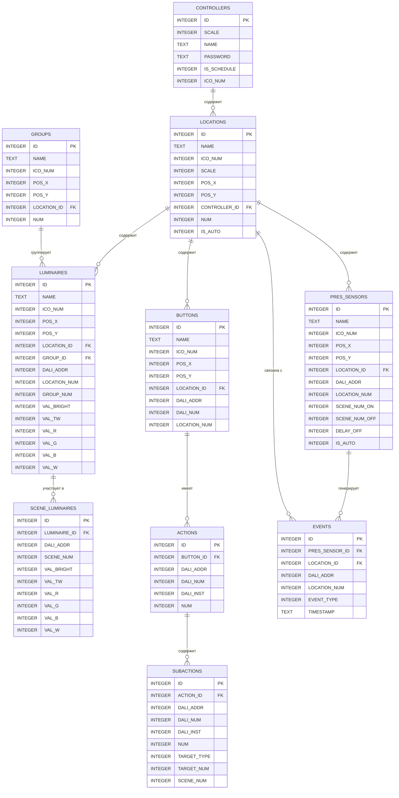

# Схема базы данных

АПК Синапс v1.0. ПО. Спецификации на разработку

**Версия документа:** 1.0  
**Дата создания:** 24.11.2025  
**Статус:** Черновик

```mermaid
erDiagram
    CONTROLLERS ||--o{ LOCATIONS : "содержит"
    LOCATIONS ||--o{ LUMINAIRES : "содержит"
    LOCATIONS ||--o{ PRES_SENSORS : "содержит"
    LOCATIONS ||--o{ BUTTONS : "содержит"
    GROUPS ||--o{ LUMINAIRES : "группирует"
    LUMINAIRES ||--o{ SCENE_LUMINAIRES : "участвует в"
    BUTTONS ||--o{ ACTIONS : "имеет"
    ACTIONS ||--o{ SUBACTIONS : "содержит"
    PRES_SENSORS ||--o{ EVENTS : "генерирует"
    LOCATIONS ||--o{ EVENTS : "связана с"

    CONTROLLERS {
        INTEGER ID PK
        INTEGER SCALE
        TEXT NAME
        TEXT PASSWORD
        INTEGER IS_SCHEDULE
        INTEGER ICO_NUM
    }

    LOCATIONS {
        INTEGER ID PK
        TEXT NAME
        INTEGER ICO_NUM
        INTEGER SCALE
        INTEGER POS_X
        INTEGER POS_Y
        INTEGER CONTROLLER_ID FK
        INTEGER NUM
        INTEGER IS_AUTO
    }

    LUMINAIRES {
        INTEGER ID PK
        TEXT NAME
        INTEGER ICO_NUM
        INTEGER POS_X
        INTEGER POS_Y
        INTEGER LOCATION_ID FK
        INTEGER GROUP_ID FK
        INTEGER DALI_ADDR
        INTEGER LOCATION_NUM
        INTEGER GROUP_NUM
        INTEGER VAL_BRIGHT
        INTEGER VAL_TW
        INTEGER VAL_R
        INTEGER VAL_G
        INTEGER VAL_B
        INTEGER VAL_W
    }

    SCENE_LUMINAIRES {
        INTEGER ID PK
        INTEGER LUMINAIRE_ID FK
        INTEGER DALI_ADDR
        INTEGER SCENE_NUM
        INTEGER VAL_BRIGHT
        INTEGER VAL_TW
        INTEGER VAL_R
        INTEGER VAL_G
        INTEGER VAL_B
        INTEGER VAL_W
    }

    GROUPS {
        INTEGER ID PK
        TEXT NAME
        INTEGER ICO_NUM
        INTEGER POS_X
        INTEGER POS_Y
        INTEGER LOCATION_ID FK
        INTEGER NUM
    }

    PRES_SENSORS {
        INTEGER ID PK
        TEXT NAME
        INTEGER ICO_NUM
        INTEGER POS_X
        INTEGER POS_Y
        INTEGER LOCATION_ID FK
        INTEGER DALI_ADDR
        INTEGER LOCATION_NUM
        INTEGER SCENE_NUM_ON
        INTEGER SCENE_NUM_OFF
        INTEGER DELAY_OFF
        INTEGER IS_AUTO
    }

    BUTTONS {
        INTEGER ID PK
        TEXT NAME
        INTEGER ICO_NUM
        INTEGER POS_X
        INTEGER POS_Y
        INTEGER LOCATION_ID FK
        INTEGER DALI_ADDR
        INTEGER DALI_NUM
        INTEGER LOCATION_NUM
    }

    ACTIONS {
        INTEGER ID PK
        INTEGER BUTTON_ID FK
        INTEGER DALI_ADDR
        INTEGER DALI_NUM
        INTEGER DALI_INST
        INTEGER NUM
    }

    SUBACTIONS {
        INTEGER ID PK
        INTEGER ACTION_ID FK
        INTEGER DALI_ADDR
        INTEGER DALI_NUM
        INTEGER DALI_INST
        INTEGER NUM
        INTEGER TARGET_TYPE
        INTEGER TARGET_NUM
        INTEGER SCENE_NUM
    }

    EVENTS {
        INTEGER ID PK
        INTEGER PRES_SENSOR_ID FK
        INTEGER LOCATION_ID FK
        INTEGER DALI_ADDR
        INTEGER LOCATION_NUM
        INTEGER EVENT_TYPE
        TEXT TIMESTAMP
    }
```

