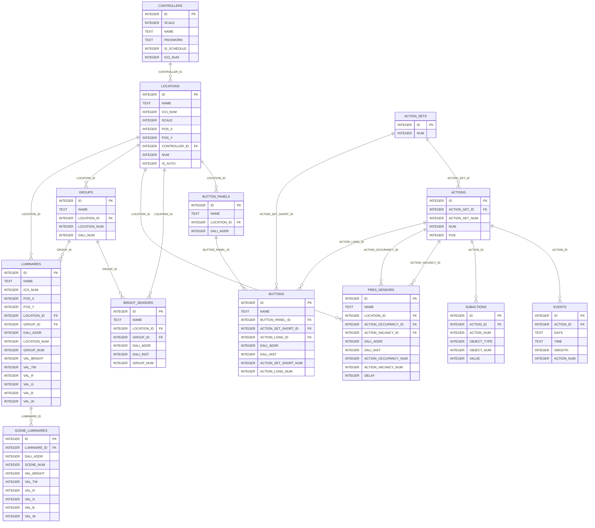

# Схема базы данных

АПК Синапс v1.0. ПО. Спецификации на разработку

**Последнее изменение:** 27.11.2025

```mermaid
erDiagram
    CONTROLLERS ||--o{ LOCATIONS : "CONTROLLER_ID"
    LOCATIONS ||--o{ LUMINAIRES : "LOCATION_ID"
    LOCATIONS ||--o{ GROUPS : "LOCATION_ID"
    LOCATIONS ||--o{ PRES_SENSORS : "LOCATION_ID"
    LOCATIONS ||--o{ BRIGHT_SENSORS : "LOCATION_ID"
    LOCATIONS ||--o{ BUTTON_PANELS : "LOCATION_ID"
    GROUPS ||--o{ LUMINAIRES : "GROUP_ID"
    GROUPS ||--o{ BRIGHT_SENSORS : "GROUP_ID"
    LUMINAIRES ||--o{ SCENE_LUMINAIRES : "LUMINAIRE_ID"
    BUTTON_PANELS ||--o{ BUTTONS : "BUTTON_PANEL_ID"
    ACTION_SETS ||--o{ BUTTONS : "ACTION_SET_SHORT_ID"
    ACTIONS ||--o{ BUTTONS : "ACTION_LONG_ID"
    ACTIONS ||--o{ PRES_SENSORS : "ACTION_OCCUPANCY_ID"
    ACTIONS ||--o{ PRES_SENSORS : "ACTION_VACANCY_ID"
    ACTION_SETS ||--o{ ACTIONS : "ACTION_SET_ID"
    ACTIONS ||--o{ SUBACTIONS : "ACTION_ID"
    ACTIONS ||--o{ EVENTS : "ACTION_ID"

    CONTROLLERS {
        INTEGER ID PK
        INTEGER SCALE
        TEXT NAME
        TEXT PASSWORD
        INTEGER IS_SCHEDULE
        INTEGER ICO_NUM
    }

    LOCATIONS {
        INTEGER ID PK
        TEXT NAME
        INTEGER ICO_NUM
        INTEGER SCALE
        INTEGER POS_X
        INTEGER POS_Y
        INTEGER CONTROLLER_ID FK
        INTEGER NUM
        INTEGER IS_AUTO
    }

    LUMINAIRES {
        INTEGER ID PK
        TEXT NAME
        INTEGER ICO_NUM
        INTEGER POS_X
        INTEGER POS_Y
        INTEGER LOCATION_ID FK
        INTEGER GROUP_ID FK
        INTEGER DALI_ADDR
        INTEGER LOCATION_NUM
        INTEGER GROUP_NUM
        INTEGER VAL_BRIGHT
        INTEGER VAL_TW
        INTEGER VAL_R
        INTEGER VAL_G
        INTEGER VAL_B
        INTEGER VAL_W
    }

    SCENE_LUMINAIRES {
        INTEGER ID PK
        INTEGER LUMINAIRE_ID FK
        INTEGER DALI_ADDR
        INTEGER SCENE_NUM
        INTEGER VAL_BRIGHT
        INTEGER VAL_TW
        INTEGER VAL_R
        INTEGER VAL_G
        INTEGER VAL_B
        INTEGER VAL_W
    }

    GROUPS {
        INTEGER ID PK
        TEXT NAME
        INTEGER LOCATION_ID FK
        INTEGER LOCATION_NUM
        INTEGER DALI_NUM
    }

    PRES_SENSORS {
        INTEGER ID PK
        TEXT NAME
        INTEGER LOCATION_ID FK
        INTEGER ACTION_OCCUPANCY_ID FK
        INTEGER ACTION_VACANCY_ID FK
        INTEGER DALI_ADDR
        INTEGER DALI_INST
        INTEGER ACTION_OCCUPANCY_NUM
        INTEGER ACTION_VACANCY_NUM
        INTEGER DELAY
    }

    BRIGHT_SENSORS {
        INTEGER ID PK
        TEXT NAME
        INTEGER LOCATION_ID FK
        INTEGER GROUP_ID FK
        INTEGER DALI_ADDR
        INTEGER DALI_INST
        INTEGER GROUP_NUM
    }

    BUTTON_PANELS {
        INTEGER ID PK
        TEXT NAME
        INTEGER LOCATION_ID FK
        INTEGER DALI_ADDR
    }

    BUTTONS {
        INTEGER ID PK
        TEXT NAME
        INTEGER BUTTON_PANEL_ID FK
        INTEGER ACTION_SET_SHORT_ID FK
        INTEGER ACTION_LONG_ID FK
        INTEGER DALI_ADDR
        INTEGER DALI_INST
        INTEGER ACTION_SET_SHORT_NUM
        INTEGER ACTION_LONG_NUM
    }

    ACTION_SETS {
        INTEGER ID PK
        INTEGER NUM
    }

    ACTIONS {
        INTEGER ID PK
        INTEGER ACTION_SET_ID FK
        INTEGER ACTION_SET_NUM
        INTEGER NUM
        INTEGER POS
    }

    SUBACTIONS {
        INTEGER ID PK
        INTEGER ACTION_ID FK
        INTEGER ACTION_NUM
        INTEGER OBJECT_TYPE
        INTEGER OBJECT_NUM
        INTEGER VALUE
    }

    EVENTS {
        INTEGER ID PK
        INTEGER ACTION_ID FK
        TEXT DAYS
        TEXT TIME
        INTEGER SMOOTH
        INTEGER ACTION_NUM
    }
```
