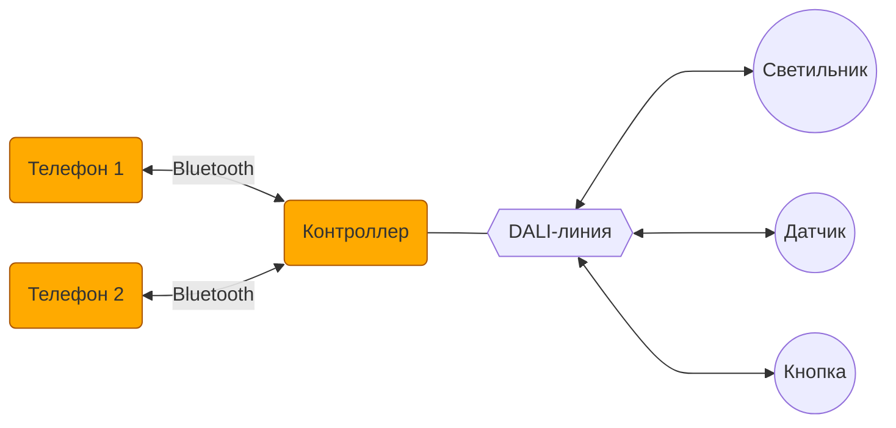

# Прошивка

АПК Синапс v1.0. ПО. Спецификации на разработку

**Последнее изменение:** 12.12.2025, 10:37 МСК

## 1. Назначение документа

Спецификация для разработчиков прошивки контроллера АПК Синапс. Документ описывает аппаратную часть, архитектуру системы, логику работы контроллера, структуры данных, взаимодействие с DALI-устройствами и мобильным приложением.

## 2. Термины и определения

2.1. **АПК** — аппаратно-программный комплекс.

2.2. **Контроллер** — устройство на базе микроконтроллера GD32F103RBT6, работающее с устройствами DALI.

2.3. **Устройство** — DALI-устройство в линии: светильник, датчик, кнопочная панель.

2.4. **Прошивка** — firmware в контроллере.

2.5. **Телефон** — мобильное устройство, обеспечивающее пользовательский интерфейс АПК.

2.6. **Приложение** — интерфейсное мобильное приложение в телефоне.

2.7. **DALI** (Digital Addressable Lighting Interface) — цифровой протокол управления освещением, который позволяет интегрировать осветительные устройства в единую систему.

2.8. **Локация** — помещение или часть помещения с отдельно от других частей объекта (контроллера) организованной работой освещения. В АПК все локации одного уровня. Иерархия локаций не предусмотрена.

2.9. **Действие (ACTION)** — изменение состояния системы освещения. Действие — произвольный набор из команд (SUBACTION):
- включений сцен светильников, сцен групп, сцен локаций, сцен всего контроллера;
- установка температуры TW у отдельного светильника, группы, локации или всего контроллера;
- включений и выключений режима АВТО в локациях.

Действия навешиваются на нажатия кнопок, сработки датчиков присутствия, события в расписании.

2.10. **Режим АВТО** — изменение освещения в локации на основе сигналов от датчиков. Включается/выключается тумблером на странице локации в приложении.

## 3. Аппаратная часть

3.1. Микроконтроллер: **GD32F103RBT6**.

3.2. Интерфейсы:
- 1 линия DALI для управления устройствами;
- Bluetooth для связи с мобильными приложениями.

3.3. Индикация: лесенка светодиодов + нижний светодиод.

3.4. Программная кнопка для сброса настроек.

## 4. Архитектура системы

4.1. Телефоны подключаются к контроллеру по Bluetooth.

4.2. С контроллером одновременно могут работать (быть подключены) несколько телефонов - до 4 шт.

4.3. К контроллеру подключается 1 линия DALI, устройствами в которой управляет АПК.

## 5. Контроллер

### 5.1. Константы (неизменяемые)

- Серийник: XXXXXXXX (8 цифр);
- Название в Bluetooth: SYNAPSE XXXXXXXX.

### 5.2. Переменные (меняются через приложение)

- Пароль: YYYY (4 цифры);
- Название, под которым контроллер значится в приложении (по умолчанию SYNAPSE XXXXXXXX);
- Номер иконки (по умолчанию дефолт — 0);
- Флаг АВТО — главный выключатель автоматического режима (по умолчанию выкл);
- Текущие дата и время для расписания (обновляются из приложения при каждом подключении телефона).

### 5.3. Индикация светодиодами

- **Нижний светодиод** мигает, если идет работа с линией DALI.
- **Лесенка светодиодов** загорается вся, если есть хотя бы одно Bluetooth-соединение с телефоном. Иначе вся лесенка не горит.

### 5.4. Программная кнопка

- **Долгое нажатие** — сброс настроек прошивки (не исполняемый код) в заводское состояние.
- **Короткое нажатие** — сброс только пароля в заводской.

## 6. Структура данных

6.1. Данные в контроллере делятся на:

- **Рабочие** — для работы с оборудованием DALI; хранятся в структурах языка С; передаются в командах между прошивкой и приложением.
- **Интерфейсные** — для формирования интерфейса приложения (названия, номера иконок, расположение иконок и т. п.); хранятся единым блоком; передаются бинарным блоком между прошивкой и приложением.

## 7. Локации

7.1. Устройства могут находиться в локациях или быть без локации (в корне контроллера).

7.2. При инициализации все найденные в линии DALI устройства помещаются в корень (без локации).

7.3. Создание локаций и распределение устройств по ним происходит по командам от приложения.

7.4. Количество локаций: до 16.

7.5. Все локации находятся на одном уровне, никакой многоуровневой иерархии не предусмотрено.

7.6. У контроллера есть общий флаг АВТО (главный выключатель автоматического режима). Если АВТО контроллера = выкл, сигналы от всех датчиков (присутствия и освещённости) игнорируются. Если АВТО контроллера = вкл, работают флаги АВТО отдельных локаций.

7.7. У каждой локации есть свой флаг АВТО. Если АВТО локации = выкл, сигналы от датчиков, действующие на устройства в данной локации, игнорируются (при условии, что АВТО контроллера = вкл).

7.8. Устройства без локации (в корне) работают в автоматическом режиме, если АВТО контроллера = вкл.

## 8. Светильники

8.1. Количество светильников ограничено емкостью линии DALI: 64 шт.

8.2. Поддерживаемые типы светильников:
- Реле (тип 7);
- Диммируемые светодиодные (тип 6);
- RGB, RGBW, TW (все три последние - тип 8).

8.3. Светильник может находиться в одной из локаций или быть без локации (в корне контроллера).

## 9. Световые сцены

9.1. Световые (цветовые) сцены в АПК соответствуют DALI-сценам и используют DALI-механизм сцен.

9.2. 5 сквозных сцен (DALI-сцены 0–4) распространяются на все светильники.

9.3. По умолчанию в сценах 0–4 светильники имеют:
- яркость: 0, 25, 50, 75, 100%;
- цвет: красный с максимальной насыщенностью.

9.4. Состояние светильников в сцены может сохраняться:
- отдельным светильником;
- группой светильников.

9.5. Команда на включение сцены может быть отдана приложением:
- отдельному светильнику;
- группе светильников;
- всем светильникам локации;
- всем светильникам контроллера.

## 10. Группы светильников

10.1. Группа может быть привязана к локации или быть без локации (в корне контроллера). Группа без локации может содержать только светильники без локации. Группа с локацией может содержать только светильники из этой же локации.

10.2. Группы в АПК соответствуют DALI-группам и используют DALI-механизм групп.

10.3. Общее максимальное количество групп (включая группы в корне и во всех локациях) — 16.

10.4. Светильник может входить только в одну группу или быть вне групп (чтобы отдельные светильники не занимали DALI-группы, которых на всех не хватит).

10.5. Светильники, объединённые в группу, получают возможность группового управления.

10.6. У светильников в группе остаётся возможность индивидуального управления и настройки.

## 11. Кнопочные панели

11.1. Количество устройств управления ограничено емкостью линии DALI: 64 шт.

11.2. Кнопочные панели — основной инструмент пользователя для оперативного управления освещением.

11.3. На **короткое нажатие** кнопки может быть повешено одно или несколько действий (ACTIONS):
- Если действие одно — при нажатии на кнопку оно и случается;
- Если действий несколько — они выполняются перебором.

11.4. На **долгое нажатие** можно повесить только одно действие (ACTION). При нажатии и удержании вкл/выкл АВТО-режима производится сразу, яркость светильников плавно меняется в направлении целевой сцены.

11.5. Действия можно вешать и на короткое, и на длинное нажатия одновременно.

## 12. Датчики присутствия

12.1. На датчик навешиваются два действия (ACTIONS): на присутствие / на отсутствие.

12.2. Действие на отсутствие срабатывает, когда датчик регистрирует отсутствие присутствия.

12.3. Если есть желание деактивировать конкретный датчик присутствия — убираем у него действия.

12.4. Действие всех датчиков на отдельно взятую локацию может быть активировано/деактивировано:
- тумблером АВТО у этой локации в приложении;
- настенной кнопкой с соответствующим ACTION Локация.Авто = OFF;
- через расписание.

12.5. Оперативное управление хотя бы одним светильником в локации временно переводит режим АВТО в этой локации в выключенное состояние. Возврат в режим Локация.Авто = ON: любой датчик присутствия данной локации регистрирует присутствие (и при этом сразу отрабатывает действие, повешенное на присутствие в этом датчике).

## 13. Датчики освещенности

13.1. К датчику может быть привязана одна и только одна группа светильников. Датчик и группа должны находиться в одной локации, либо оба должны быть без локации (в корне).

13.2. Группа светильников может быть привязана только к одному датчику.

13.3. Если есть желание деактивировать конкретный датчик освещённости — убираем у него привязку к группе.

13.4. Действие датчиков активируется/деактивируется:
- для датчиков в локации — тумблером АВТО локации (при условии АВТО контроллера = вкл);
- для датчиков в корне — тумблером АВТО контроллера;
- через настенную кнопку или расписание.

13.5. Датчик по команде из приложения запоминает текущую освещённость как целевую для каждой из 5 сцен группы в момент сохранения каждой из сцен.

13.6. При привязке датчика освещенности к группе группа последовательно переводится в каждую из 5 сцен. В момент работы каждой сцены сохраняется её целевая освещённость (начальная установка).

13.7. Если при сохранении сцены (и, соответственно, задания целевой освещённости) светильник полностью выключен, он в подкрутке освещённости по датчику участвовать не будет.

13.8. Любое изменение яркости светильников в группе, отличное от включения одной из её 5 сцен, отключает подкрутку яркости в ней по датчику освещённости.

13.9. Включение у группы любым способом одной из её сцен переводит группу в режим поддержания целевой освещённости.

## 14. Действия (ACTION)

14.1. Действие (ACTION) — набор из команд (SUBACTIONS):
- включение сцены у отдельного светильника, группы, локации, корня или всего контроллера;
- установка температуры TW у отдельного светильника, группы, локации, корня или всего контроллера;
- включение/выключение режима АВТО у локации или контроллера.

14.2. Навешиваются на нажатия кнопок, срабатывание датчиков присутствия, события расписания.

14.3. Действие может распространяться на любые локации и весь контроллер независимо от расположения инициирующего устройства.

## 15. Расписание

15.1. Расписание задается в виде набора событий (EVENTS), при возникновении каждого из которых выполняется действие (ACTION).

15.2. События могут быть ежедневными или назначаться на определённые дни недели.

15.3. Расписание одно для всего контроллера.

15.4. Расписание может быть активировано/деактивировано.

15.5. Необходимость действий (ACTIONS) по событиям расписания (EVENTS) проверяется контроллером раз в 1 минуту.

15.6. Если на одно время назначено и ежедневное событие и событие на день недели, сначала выполняется первое, затем второе.

15.7. На одно и то же время нельзя назначить два ежедневных событий и/или два события по дням недели.

15.8. Действие может производиться одномоментно (EVENTS.SMOOTH = F), когда параметры меняются шагово, и плавно (EVENTS.SMOOTH = T), когда параметры, меняемые у устройств, линейно изменяются от предыдущих значений к значениям, заданным в ACTIONS.

15.9. При плавном изменении параметров (SMOOTH = T) изменение производится раз в 1 минуту.

## 16. Автоматическая работа

16.1. Автоматическая работа по датчикам и расписанию при соответствующих флагах, выставленных в локациях.

16.2. Опрос текущего состояния устройств в периоды затишья.

16.3. При отправке устройствам команд на изменение состояния последующий опрос того, подействовали ли эти команды, не предполагается. Выстрелили сообразно стандартам DALI и забыли. Сказали светильнику включиться на 33, считаем, что он включился на 33.

## 17. Bluetooth-взаимодействие с приложением

17.1. С контроллером одновременно могут работать несколько телефонов.

17.2. Структура данных в контроллере синхронизируется с приложением через Bluetooth.

17.3. Рабочие данные передаются в командах между прошивкой и приложением.

17.4. Интерфейсные данные передаются бинарным блоком между прошивкой и приложением.

17.5. Протокол Bluetooth описан в отдельном документе: **SynapsePDS_FW_Bluetooth.md**.

## 18. ПНР

### 18.1. Инициализация линии DALI

18.1.1. Инициализация по команде от приложения линии DALI со сбросом настроек устройств к состоянию RESET.

18.1.2. При инициализации кроме DALI-настроек удаляются все локации (и создаётся одна, в которую все вновь найденные устройства складируются), устройства, группы, расписание.

18.1.3. Передача в приложение текущего статуса инициализации устройств для информирования пользователя о ходе процесса.

18.1.4. Перед инициализацией все светильники широковещательно выключаются (у кнопок выключаются светодиоды). После успешной выдачи устройству короткого адреса DALI: светильник включается (у кнопок включаются светодиоды).

### 18.2. Добавление новых устройств

18.2.1. Добавление новых устройств в линию без пересбора линии.

### 18.3. Замена устройств

18.3.1. Замена вышедших из строя устройств без пересбора линии:
- подключение новых устройств к линии;
- поиск устройств;
- сопоставление их вышедшим из строя;
- перенос старых настроек в новые устройства (название, короткий адрес DALI, FADETIME и т. д.).

## 19. Обновление прошивки

19.1. Возможность обновления прошивки с помощью приложения через Bluetooth.

## 20. Вопросы

20.1. Каким образом будет обновляться прошивка? (детали протокола обновления)

20.2. Должна ли температура света включаться в сцены (сейчас не включена)?

## 21. Идеи

22.1. Долгим нажатием на настенную кнопку сохранять сцену.

22.2. Должна ли прошивка работать с LLM?
