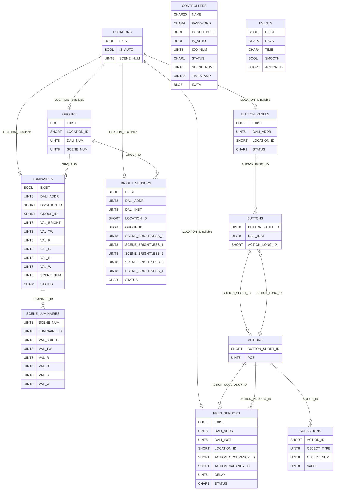

# Схема базы данных прошивки

АПК Синапс v1.0. ПО. Спецификации на разработку

**Последнее изменение:** 12.12.2025, 15:15 МСК

```mermaid
erDiagram
    LOCATIONS ||--o| LUMINAIRES : "LOCATION_ID nullable"
    LOCATIONS ||--o| GROUPS : "LOCATION_ID nullable"
    LOCATIONS ||--o| PRES_SENSORS : "LOCATION_ID nullable"
    LOCATIONS ||--o| BRIGHT_SENSORS : "LOCATION_ID nullable"
    LOCATIONS ||--o| BUTTON_PANELS : "LOCATION_ID nullable"
    GROUPS ||--o{ LUMINAIRES : "GROUP_ID"
    GROUPS ||--o{ BRIGHT_SENSORS : "GROUP_ID"
    LUMINAIRES ||--o{ SCENE_LUMINAIRES : "LUMINAIRE_ID"
    BUTTON_PANELS ||--o{ BUTTONS : "BUTTON_PANEL_ID"
    BUTTONS ||--o{ ACTIONS : "BUTTON_SHORT_ID"
    ACTIONS ||--o{ BUTTONS : "ACTION_LONG_ID"
    ACTIONS ||--o{ PRES_SENSORS : "ACTION_OCCUPANCY_ID"
    ACTIONS ||--o{ PRES_SENSORS : "ACTION_VACANCY_ID"
    ACTIONS ||--o{ SUBACTIONS : "ACTION_ID"

    CONTROLLERS {
        CHAR20 NAME
        CHAR4 PASSWORD
        BOOL IS_SCHEDULE
        BOOL IS_AUTO
        UINT8 ICO_NUM
        CHAR1 STATUS
        UINT8 SCENE_NUM
        UINT32 TIMESTAMP
        BLOB IDATA
    }

    LOCATIONS {
        BOOL EXIST
        BOOL IS_AUTO
        UINT8 SCENE_NUM
    }

    GROUPS {
        BOOL EXIST
        SHORT LOCATION_ID
        UINT8 DALI_NUM
        UINT8 SCENE_NUM
    }

    LUMINAIRES {
        BOOL EXIST
        UINT8 DALI_ADDR
        SHORT LOCATION_ID
        SHORT GROUP_ID
        UINT8 VAL_BRIGHT
        UINT8 VAL_TW
        UINT8 VAL_R
        UINT8 VAL_G
        UINT8 VAL_B
        UINT8 VAL_W
        UINT8 SCENE_NUM
        CHAR1 STATUS
    }

    SCENE_LUMINAIRES {
        UINT8 SCENE_NUM
        UINT8 LUMINAIRE_ID
        UINT8 VAL_BRIGHT
        UINT8 VAL_TW
        UINT8 VAL_R
        UINT8 VAL_G
        UINT8 VAL_B
        UINT8 VAL_W
    }

    PRES_SENSORS {
        BOOL EXIST
        UINT8 DALI_ADDR
        UINT8 DALI_INST
        SHORT LOCATION_ID
        SHORT ACTION_OCCUPANCY_ID
        SHORT ACTION_VACANCY_ID
        UINT8 DELAY
        CHAR1 STATUS
    }

    BRIGHT_SENSORS {
        BOOL EXIST
        UINT8 DALI_ADDR
        UINT8 DALI_INST
        SHORT LOCATION_ID
        SHORT GROUP_ID
        UINT8 SCENE_BRIGHTNESS_0
        UINT8 SCENE_BRIGHTNESS_1
        UINT8 SCENE_BRIGHTNESS_2
        UINT8 SCENE_BRIGHTNESS_3
        UINT8 SCENE_BRIGHTNESS_4
        CHAR1 STATUS
    }

    BUTTON_PANELS {
        BOOL EXIST
        UINT8 DALI_ADDR
        SHORT LOCATION_ID
        CHAR1 STATUS
    }

    BUTTONS {
        UINT8 BUTTON_PANEL_ID
        UINT8 DALI_INST
        SHORT ACTION_LONG_ID
    }

    ACTIONS {
        SHORT BUTTON_SHORT_ID
        UINT8 POS
    }

    SUBACTIONS {
        SHORT ACTION_ID
        UINT8 OBJECT_TYPE
        UINT8 OBJECT_NUM
        UINT8 VALUE
    }

    EVENTS {
        BOOL EXIST
        CHAR7 DAYS
        CHAR4 TIME
        BOOL SMOOTH
        SHORT ACTION_ID
    }
```
