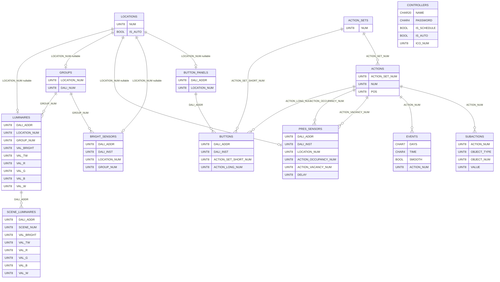

# Схема базы данных прошивки

АПК Синапс v1.0. ПО. Спецификации на разработку

**Последнее изменение:** 04.12.2025

```mermaid
erDiagram
    LOCATIONS ||--o| LUMINAIRES : "LOCATION_NUM nullable"
    LOCATIONS ||--o| GROUPS : "LOCATION_NUM nullable"
    LOCATIONS ||--o| PRES_SENSORS : "LOCATION_NUM nullable"
    LOCATIONS ||--o| BRIGHT_SENSORS : "LOCATION_NUM nullable"
    LOCATIONS ||--o| BUTTON_PANELS : "LOCATION_NUM nullable"
    GROUPS ||--o{ LUMINAIRES : "GROUP_NUM"
    GROUPS ||--o{ BRIGHT_SENSORS : "GROUP_NUM"
    LUMINAIRES ||--o{ SCENE_LUMINAIRES : "DALI_ADDR"
    BUTTON_PANELS ||--o{ BUTTONS : "DALI_ADDR"
    ACTION_SETS ||--o{ BUTTONS : "ACTION_SET_SHORT_NUM"
    ACTION_SETS ||--o{ ACTIONS : "ACTION_SET_NUM"
    ACTIONS ||--o{ BUTTONS : "ACTION_LONG_NUM"
    ACTIONS ||--o{ PRES_SENSORS : "ACTION_OCCUPANCY_NUM"
    ACTIONS ||--o{ PRES_SENSORS : "ACTION_VACANCY_NUM"
    ACTIONS ||--o{ EVENTS : "ACTION_NUM"
    ACTIONS ||--o{ SUBACTIONS : "ACTION_NUM"

    CONTROLLERS {
        CHAR20 NAME
        CHAR4 PASSWORD
        BOOL IS_SCHEDULE
        BOOL IS_AUTO
        UINT8 ICO_NUM
    }

    LOCATIONS {
        UINT8 NUM
        BOOL IS_AUTO
    }

    LUMINAIRES {
        UINT8 DALI_ADDR
        UINT8 LOCATION_NUM
        UINT8 GROUP_NUM
        UINT8 VAL_BRIGHT
        UINT8 VAL_TW
        UINT8 VAL_R
        UINT8 VAL_G
        UINT8 VAL_B
        UINT8 VAL_W
    }

    SCENE_LUMINAIRES {
        UINT8 DALI_ADDR
        UINT8 SCENE_NUM
        UINT8 VAL_BRIGHT
        UINT8 VAL_TW
        UINT8 VAL_R
        UINT8 VAL_G
        UINT8 VAL_B
        UINT8 VAL_W
    }

    GROUPS {
        UINT8 LOCATION_NUM
        UINT8 DALI_NUM
    }

    PRES_SENSORS {
        UINT8 DALI_ADDR
        UINT8 DALI_INST
        UINT8 LOCATION_NUM
        UINT8 ACTION_OCCUPANCY_NUM
        UINT8 ACTION_VACANCY_NUM
        UINT8 DELAY
    }

    BRIGHT_SENSORS {
        UINT8 DALI_ADDR
        UINT8 DALI_INST
        UINT8 LOCATION_NUM
        UINT8 GROUP_NUM
    }

    BUTTON_PANELS {
        UINT8 DALI_ADDR
        UINT8 LOCATION_NUM
    }

    BUTTONS {
        UINT8 DALI_ADDR
        UINT8 DALI_INST
        UINT8 ACTION_SET_SHORT_NUM
        UINT8 ACTION_LONG_NUM
    }

    ACTION_SETS {
        UINT8 NUM
    }

    ACTIONS {
        UINT8 ACTION_SET_NUM
        UINT8 NUM
        UINT8 POS
    }

    SUBACTIONS {
        UINT8 ACTION_NUM
        UINT8 OBJECT_TYPE
        UINT8 OBJECT_NUM
        UINT8 VALUE
    }

    EVENTS {
        CHAR7 DAYS
        CHAR4 TIME
        BOOL SMOOTH
        UINT8 ACTION_NUM
    }
```
