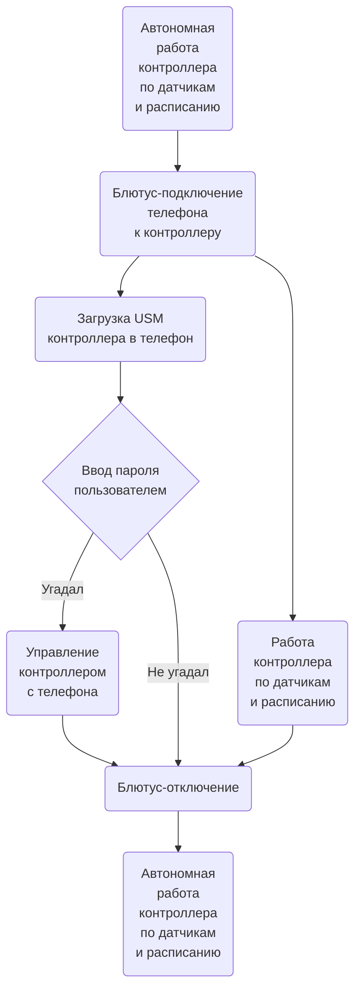
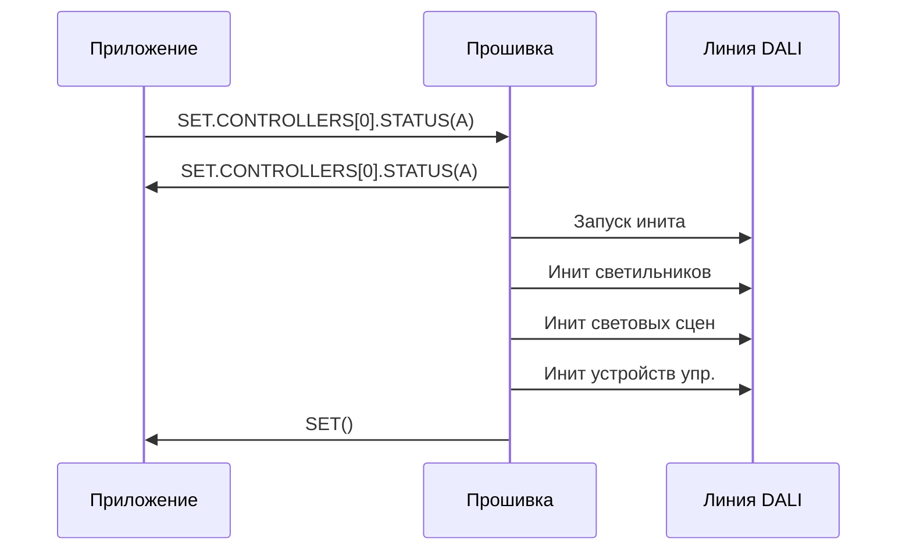

# Прошивка. Логика работы

АПК Синапс v1.0. ПО. Спецификации на разработку

**Последнее изменение:** 07.12.2025

## 1. Термины и определения

1.1. **Прошивка** — firmware в контроллере.

1.2. **Приложение** — интерфейсное мобильное приложение в телефоне.

1.3. **LLM** — Large Language Model (большая языковая модель).

1.4. **USM** (Unit System Model) — виртуальная модель системы освещения.

1.5. **USML** (Unit System Model Language) — система команд (телеграмм) для передачи данных в рамках АПК Синапс. Описано в **SynapsePDS_USML**.

1.6. **База данных прошивки** — разложенные по массивам структур Си «таблицы» с данными контроллера, светильников, датчиков и т.д. В описании логики называются таблицами, хотя и ежу понятно, что фактически формат хранения у них другой. Описано в **SynapsePDS_FW_DB**.

## 2. Взаимодействие с телефоном

2.1. С мобильным приложением прошивка работает через Bluetooth.

2.2. К контроллеру могут подключаться и параллельно работать с прошивкой до 4 телефонов. В перспективе. Пока один.

2.3. Общение между приложением и прошивкой идёт через телеграммы.

2.4. Прошивке без разницы, сколько приложений со своих телефонов подключились к контроллеру и работают с ней:
- приём телеграмм идёт как будто от одного устройства
- передача производится широковещательно

2.5. Схема взаимодействия в общих чертах:

## 3. Загрузка USM контроллера в телефон

3.1. После установки блютус-соединения ещё до проверки пользователя на знание пароля контроллер передаёт свою USM в приложение.

3.2. Передача производится USML-телегой SET().

3.3. Т.о. в приложении оказывается своя копия USM-данных контроллера.

## 4. Пуско-наладочные работы

### 4.1. Сохранение IDATA

4.1.1. Передача интерфейсных данных с телефона на контроллер производится телегой SET.CONTROLLERS[0].IDATA(...).

4.1.2. При получении её прошивка сохраняет данные в память и шлёт ту же телегу назад.

### 4.2. Инициализация линии DALI

4.2.1. Происходит следующее:
- В USM контроллера очищается всё кроме имени, иконки и пароля контроллера.
- В линии DALI происходит полный INITIALISE светильников и устройств управления.
- Согласно набору найденных устройств создаётся новая USM.
- Световые сцены 0..4 инициализируются начальными значениями.
- Новая версия USM передаётся в приложение.

4.2.2. Никакие локации и группы при этом не создаются. Все устройства помещаются вне локаций в «корень». Их LOCATION_ID = -1.

4.2.3. Порядок инициализации:

- Прошивка получает от приложения телегу `SET.CONTROLLERS[0].STATUS(I)`.

- Сама отвечает приложению телегой `SET.CONTROLLERS[0].STATUS(I)`.

- Очищаются все таблицы кроме **CONTROLLERS** (поля EXIST выставляются в F). Все байты в IDATA сбрасываются в 0.

- В единственной записи **CONTROLLERS** устанавливаются:
    - NAME - не меняется
    - PASSWORD - не меняется
    - ICO_NUM - не меняется
    - IS_SCHEDULE = F
    - IS_AUTO = F
    - STATUS = A
    - SCENE_NUM = -1

- Широковещательно выключаются в линии все светильники и светодиоды кнопочных панелей.

- Все устройства в линии DALI сбрасываются в состояние RESET.

- Раздаются короткие DALI-адреса светильникам. Светильник, получивший адрес, включается на макс.

- Светильники добавляются в таблицу **LUMINAIRES** с **LOCATION_NUM = -1** (без локации, в корне).

- В светильники в линии DALI записываются значения для сцен 0..4.
    - реле (тип 7) яркость: 0 — 0%, 1..4 — 100%
    - диммируемые светодиодные (тип 6) яркости: 0, 25, 50, 75, 100% соответственно
    - RGB, RGBW (тип 8): красный цвет яркостью от 0, 25, 50, 75, 100%
    - TW (тип 8) яркости: 0, 25, 50, 75, 100% соответственно и температуру везде 4000K

- Параллельно с инициализацией сцен в линии DALI инициализируется таблица **SCENE_LUMINAIRES**.

- Раздаются короткие DALI-адреса устройствам управления.

- Устройства управления добавляются в таблицы **BUTTON_PANELS**, **BUTTONS**, **PRES_SENSORS**, **BRIGHT_SENSORS** с **LOCATION_NUM = -1** (без локации, в корне).

- Статус в CONTROLLERS.STATUS устанавливается в A.

- Отправляется телега приложению: `SET()`.

### 4.3. Расширение линии DALI

4.3.1. Производится аналогично инициализации, только без сброса текущих настроек.

4.3.2. Новые устройства добавляются с LOCATION_ID = -1, т.е. без локации, в «корень».

### 4.4. Замена устройства в линии DALI

4.4.1. Замена вышедшего из строя устройства на новое того же типа с сохранением всех настроек старого.

4.4.2. Порядок замены:
- От приложения в прошивку приходит телега SET.<TBLNAME\>[<DEVID\>].STATUS("C").
- Контроллер отправляет приложению телегу SET.CONTROLLER[0].STATUS(I).
- Контроллер проводит магический обряд по замене.
- Контроллер отправляет приложению телегу SET.<TBLNAME\>[<DEVID\>].STATUS(A).
- Контроллер отправляет приложению телегу SET.CONTROLLER[0].STATUS(A).

### 4.5. Создание и удаление локаций, распределение по ним устройств

4.5.1. Создание и удаление локации производится по одной и той же телеге: SET.LOCATIONS[<LOCID\>].EXIST(...). Прошивка производит изменения у себя в USM и отправляет телеги об изменениях приложению.

4.5.2. Помещение устройств в локацию производится поштучно телегами SET.<TBL\>[<DEVID\>].LOCATION_ID(<LOCID\>).

4.5.3. Перемещение из локации в корень: <LOCID\> = -1.

### 4.6. Создание и удаление групп, распределение по ним устройств

4.6.1. Создание и удаление групп производится по одной и той же телеге: SET.GROUPS[<GRPID\>].EXIST(...). Прошивка производит изменения у себя в USM и отправляет телеги об изменениях приложению.

4.6.2. Помещение устройств в группу производится поштучно телегами SET.<TBL\>[<DEVID\>].GROUP_ID(<GRPID\>).

4.6.3. Перемещение из группы: <GRPID\> = -1.

### 4.7. Именование и раздача пиктограмм контроллеру, локациям, устройствам

4.7.1. Всё это — интерфейсные данные, поэтому передаются телегой SET.CONTROLLERS[0].IDATA(...) в прошивку, а после изменения в прошивке назад этой же телегой в приложение.

### 4.8. Назначение действий на присутствие и отсутствие датчиков присутствия

4.8.1. 

## 5. Настройка

## 6. Оперативное управление

## 7. Работа по датчикам

## 8. Работа по расписанию

## 9. Сброс контроллера железной кнопкой

## 10. Индикация на контроллере

## 11. Вопросы

11.1. У нас ведь все команды (на задание яркости светильника и т.п.) в DALI идут от контроллера? Т.е., если всё отрабатывает нормально, контроллер всегда знает актуальное состояние устройства в линии?

11.2. Как лучше отправлять?
- одну телегу со всей записью и потом в обработчике это разбирать
- две телеги каждую с одним полем

## 12. Идеи

