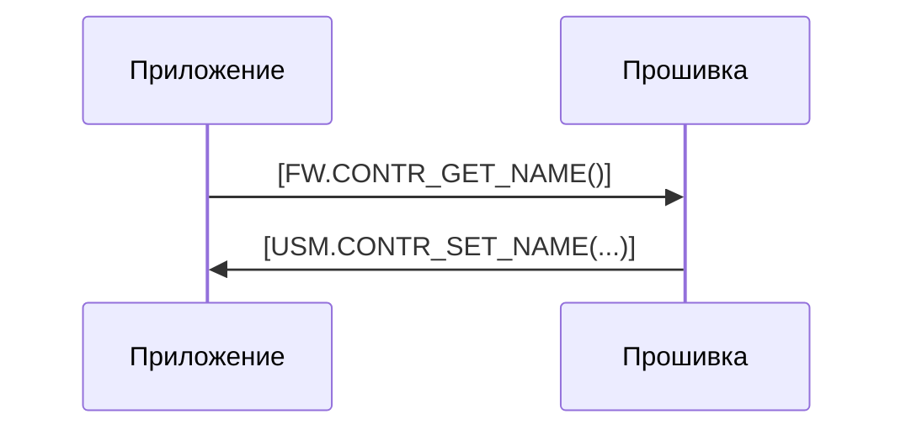
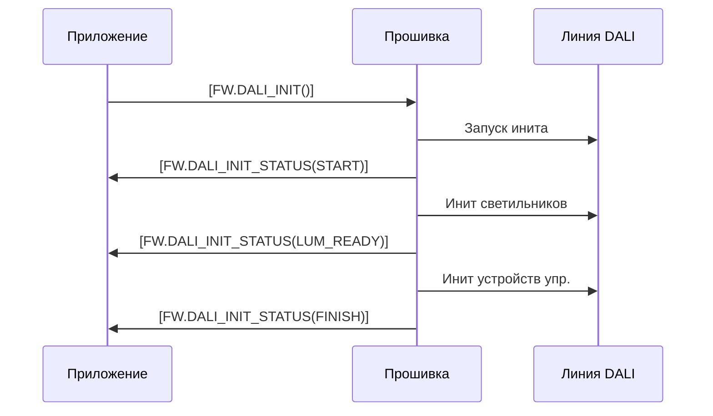

# Логика работы прошивки

АПК Синапс v1.0. ПО. Спецификации на разработку

**Последнее изменение:** 01.12.2025

## 1. Термины и определения

1.1. **Прошивка** — firmware в контроллере.

1.2. **Приложение** — интерфейсное мобильное приложение в телефоне.

1.3. **LLM** — Large Language Model (большая языковая модель).

1.4. **USML** (Unit System Model Language) — система команд (телеграмм) для передачи данных в рамках АПК Синапс. Предназначен для общения LLM, мобильного приложения и прошивки контроллера. Описано в SynapsePDS_USML.md.

## 2. Взаимодействие с телефоном

2.1. С мобильным приложением прошивка работает через Bluetooth.

2.2. К контроллеру могут подключаться и параллельно работать с прошивкой до 4 телефонов.

2.3. Общение между приложением и прошивкой идёт через телеграммы.

2.4. Телеграммы, имеющие хождение в комплексе Синапс, бывают двух видов:
- **софт-телеги** (понимаемые приложением, LLM и нормальными людьми) — внутри приложения и между приложением и LLM
- **хард-телеги** (понимаемые прошивкой и электронщиками) — между приложением и прошивкой

2.5. На стыке между приложением и прошивкой подмножество софт-телег, которое имеет смысл в прошивке, конвертируется в хард-телеги и наоборот.

2.6. Стык (конвертер) находится на стороне приложения.

2.7. Формат телеграмм, соответствие софт-телег и хард-телег и язык USML в целом описаны в SynapsePDS_USML.md.

2.8. При описании логики работы прошивки используются софт-версии телег.

2.9. Прошивке без разницы, сколько приложений со своих телефонов подключились к контроллеру и работают с ней:
- приём телеграмм идёт как будто от одного устройства
- передача производится широковещательно

2.10. Телеграммы можно разделить на:
- телеги от приложения на запрос данных — в ответ на них прошивка отправляет запрошенные данные, при этом состояние данных прошивки не меняется
- телеги от приложения с командами на изменение данных в контроллере и/или отправку команд устройствам DALI — это команды на изменение имени контроллера, иконки, блока интерфейсных данных, расписания, яркости светильников, параметров светильников и датчиков и т.п.; прошивка при получении выполняет команду и отправляет телегу с новыми значениями всем подключённым телефонам, тем самым обеспечивая синхронизацию
- телеги от прошивки к приложениям, инициируемые самой прошивкой — это телеги об изменениях, произведённых самой прошивкой (отработка расписания, подстройка яркости по датчикам и т.п.), или пришедшие из линии DALI (нажатие кнопок, сработка датчиков)

## 3. Данные контроллера

3.1. Данные, которые контроллер хранит в постоянной памяти:
- NAME — имя контроллера (строка)
- PASSWORD — пароль (4 цифры) (строка)
- IS_SCHEDULE — флаг включена ли работа по расписанию (T/F)
- ICO_NUM — номер иконки контроллера (целое, значения 100..199)
- INTERFACE_DATA — интерфейсные данные (энное количество байтов; см. ниже)

3.2. Часть данных, которые контроллер хранит в постоянной памяти, являются интерфейсными — используемыми только приложениями. Их прошивка хранит единым блоком для синхронизации между несколькими телефонами. Единым блоком эти данные попадают в прошивку, единым блоком она приложению их и отдаёт. 

3.3. Передача данных от приложения контроллеру (здесь и далее изменение названия):
`[FW.CONTR_SET_NAME(...)]`

3.4. Передача данных от контроллера приложению:
`[USM.CONTR_SET_NAME(...)]`

3.5. Запрос от приложения контроллеру:
`[FW.CONTR_GET_NAME()]` — запрос данных контроллера.
В ответ на эту телегу прошивка должна ответить телегой `[USM.CONTR_SET_NAME(...)]`.

## 4. Пуско-наладочные работы

### 4.1. Инициализация линии DALI

4.1.1. Процесс инициализации:

- Прошивка получает от приложения телегу `[FW.DALI_INIT()]`.

- Широковещательно выключаются в линии все светильники и светодиоды кнопочных панелей.

- Отправляется телега приложению: `[FW.DALI_INIT_STATUS(START)]`.

- Раздаются короткие DALI-адреса светильникам.

- Отправляется телега приложению: `[FW.DALI_INIT_STATUS(LUM_READY)]`.

- Раздаются короткие DALI-адреса устройствам управления.

- Отправляется телега приложению: `[FW.DALI_INIT_STATUS(FINISH)]`.

(Хотелось бы получать текущий статус инициализации более детализированно, поскольку процесс показывается пользователю в виде прогресс-бара.)

### 4.2. Расширение линии DALI

### 4.3. Замена устройства в линии DALI

## 5. Настройка

## 6. Оперативное управление

## 7. Работа по датчикам

## 8. Работа по расписанию

## 9. Вопросы

## 10. Идеи
