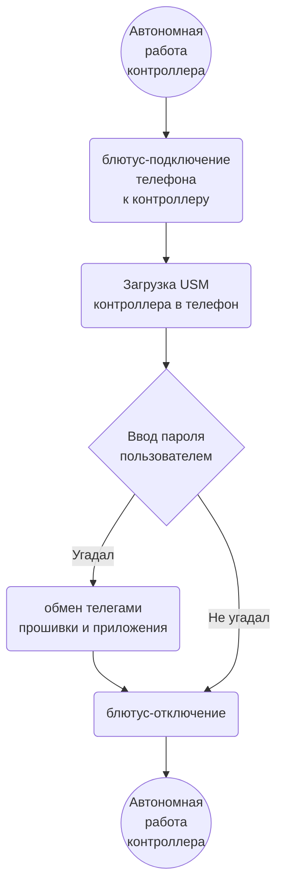
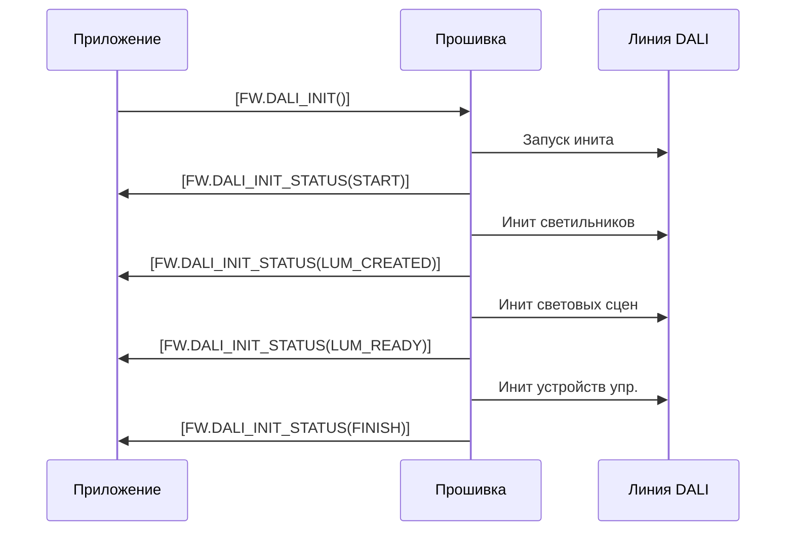

# Прошивка. Логика работы

АПК Синапс v1.0. ПО. Спецификации на разработку

**Последнее изменение:** 06.12.2025

## 1. Термины и определения

1.1. **Прошивка** — firmware в контроллере.

1.2. **Приложение** — интерфейсное мобильное приложение в телефоне.

1.3. **LLM** — Large Language Model (большая языковая модель).

1.1. **USM** (Unit System Model) — виртуальная модель системы освещения.

1.4. **USML** (Unit System Model Language) — система команд (телеграмм) для передачи данных в рамках АПК Синапс. Описано в **[SynapsePDS_USML](SynapsePDS_USML.html)**.

1.5. **База данных прошивки** — разложенные по массивам структур Си «таблицы» с данными контроллера, светильников, датчиков и т.д. В описании логики называются таблицами, хотя и ежу понятно, что фактически формат хранения у них другой. Описано в **[SynapsePDS_FW_DB](SynapsePDS_FW_DB.html)**.

## 2. Взаимодействие с телефоном

2.1. С мобильным приложением прошивка работает через Bluetooth.

2.2. К контроллеру могут подключаться и параллельно работать с прошивкой до 4 телефонов. В перспективе. Пока один.

2.3. Общение между приложением и прошивкой идёт через телеграммы.

2.9. Прошивке без разницы, сколько приложений со своих телефонов подключились к контроллеру и работают с ней:
- приём телеграмм идёт как будто от одного устройства
- передача производится широковещательно

2.9. Схема взаимодействия в общих чертах:

## 3. Данные контроллера

3.1. Данные, которые контроллер хранит в постоянной памяти:
- NAME — имя контроллера (строка)
- PASSWORD — пароль (4 цифры) (строка)
- IS_SCHEDULE — флаг включена ли работа по расписанию (T/F)
- IS_AUTO — главный выключатель автоматического режима (T/F)
- ICO_NUM — номер иконки контроллера (целое, значения 100..199)
- IDATA — интерфейсные данные (энное количество байтов; см. ниже)

3.2. Как эти данные хранятся в контроллере науке не известно. Поэтому условно считаем, что есть некая таблица **[CONTROLLERS](SynapsePDS_FW_DB.html#32-controllers)**, где в виде единственной записи они и находятся.

3.2. Часть данных (IDATA), которые контроллер хранит в постоянной памяти, являются интерфейсными — используемыми только приложениями. Их прошивка хранит единым блоком для синхронизации между несколькими телефонами. Единым блоком эти данные попадают в прошивку, единым блоком она приложению их и отдаёт. 

## 4. Пуско-наладочные работы

### 4.1. Инициализация линии DALI

4.1.1. Что такое

Удаляется из базы данных контроллера всё, что было настроено непосильным трудом (если что-то настраивалось), кроме настроек самого контроллера (имя, иконка, пароль, IS_AUTO). Инициализируются все светильники и устройства управления линии DALI, начиная с раздачи рандомных адресов и заканчивая сбросом всех настроек устройств в состояние RESET. Все устройства создаются в корне (LOCATION_NUM = 0), локации не создаются.

4.1.2. Порядок инициализации:

- Прошивка получает от приложения телегу `[FW.DALI_INIT()]`.

- Отправляется телега приложению: `[FW.DALI_INIT_STATUS(START)]`.

- Очищаются все таблицы кроме **[CONTROLLERS](SynapsePDS_FW_DB.html#32-controllers)**. Устанавливается **[CONTROLLERS](SynapsePDS_FW_DB.html#32-controllers)**.IS_SCHEDULE = F, **[CONTROLLERS](SynapsePDS_FW_DB.html#32-controllers)**.IS_AUTO = F.

- Широковещательно выключаются в линии все светильники и светодиоды кнопочных панелей.

- Раздаются короткие DALI-адреса светильникам. Светильник, получивший адрес, включается на макс.

- Светильники добавляются в таблицу **[LUMINAIRES](SynapsePDS_FW_DB.html#35-luminaires)** с **LOCATION_NUM = 0** (без локации, в корне).

- Отправляется телега приложению: `[FW.DALI_INIT_STATUS(LUM_CREATED)]`.

- В светильники в линии DALI записываются значения для сцен 0..4.  
    - реле (тип 7) яркость: 0 - 0%, 1..4 - 100%
    - диммируемые светодиодные (тип 6) яркости: 0, 25, 50, 75, 100% соответственно
    - RGB, RGBW (тип 8): красный цвет яркостью от 0, 25, 50, 75, 100%
    - TW (тип 8) яркости: 0, 25, 50, 75, 100% соответственно и температуру везде 4000K

- Отправляется телега приложению: `[FW.DALI_INIT_STATUS(LUM_READY)]`.

- Раздаются короткие DALI-адреса устройствам управления.

- Устройства управления добавляются в таблицы **[BUTTON_PANELS](SynapsePDS_FW_DB.html#39-button-panels)**, **[BUTTONS](SynapsePDS_FW_DB.html#310-buttons)**, **[PRES_SENSORS](SynapsePDS_FW_DB.html#37-pres-sensors)**, **[BRIGHT_SENSORS](SynapsePDS_FW_DB.html#38-bright-sensors)** с **LOCATION_NUM = 0** (без локации, в корне).

- Отправляется телега приложению: `[FW.DALI_INIT_STATUS(FINISH)]`.

(Хотелось бы получать текущий статус инициализации более детализированно, поскольку процесс показывается пользователю в виде прогресс-бара.)

### 4.2. Расширение линии DALI

4.2.1. Что такое

Без изменения текущей настроенной системы в неё добавляются вновь подключенные к линии DALI устройства.

### 4.3. Замена устройства в линии DALI

4.3.1. Что такое

Замена вышедшего из строя устройства на новое того же типа с сохранением всех настроек старого.

## 5. Настройка

## 6. Оперативное управление

## 7. Работа по датчикам

## 8. Работа по расписанию

## 9. Вопросы

## 10. Идеи
