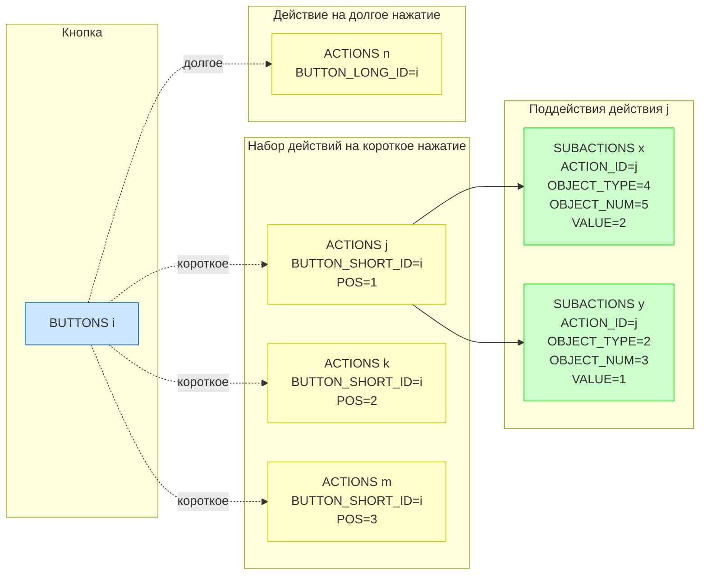

# Прошивка. Логика работы

АПК Синапс v1.0. ПО. Спецификации на разработку

**Последнее изменение:** 13.12.2025, 07:59 МСК

## 1. Назначение документа

Дать разработчику исчерпывающее понимание логики работы прошивки контроллера АПК Синапс.

## 2. Базовые документы

Обязатльны к предварительному прочтению и последующему заглядывантию.

- **SynapsePDS_FW** — описание прошивки контроллера
- **SynapsePDS_FW_DB** — структура базы данных прошивки
- **SynapsePDS_USML** — протокол обмена данными

## 3. Термины и определения

3.1. **FW-USM** (Unit System Model прошивки) — виртуальная модель системы освещения в прошивке. Представляет собой набор массивов структур языка С, хранящих состояние всех устройств DALI-линии, настройки локаций, групп, действия, расписание и другие данные. Структура описана в **SynapsePDS_FW_DB**.

3.2. **APP-USM** — виртуальная модель системы освещения в приложении (SQLite). Является кэшем FW-USM для оперативного доступа UI и LLM к данным контроллера.

3.3. **USML** (Unit System Model Language) — бинарный протокол передачи данных между прошивкой и приложением.

3.4. **Телеграмма** (телега) — команда в формате USML, содержащая изменения USM.

3.5. **Рабочие данные** — данные для организации работы освещения (яркость светильников, адреса DALI, действия датчиков и т.п.). Хранятся в прошивке в виде массивов структур C.

3.6. **Интерфейсные данные** (IDATA) — данные для UI приложения (названия, номера иконок, координаты). В прошивке хранятся единым блоком размером 50000 байт.

3.7. **ACTION** — действие, состоящее из одного или нескольких поддействий (SUBACTION).

3.8. **SUBACTION** — элементарное изменение системы освещения (включение сцены у светильника/группы/локации, установка температуры TW, переключение режима АВТО).

## 4. Базовые принципы

### 4.1. Режимы работы контроллера

4.1.1. Прошивка в контроллере может работать в двух режимах:
- **Автономный режим** — контроллер обрабатывает сигналы от настенных кнопок, датчиков присутствия, датчиков освещённости, обеспечивает работу по расписанию.
- **Режим с подключением телефонов** — дополнительно к автономному режиму осуществляется ПНР, настройка и оперативное управление системой освещения.

4.1.2. К контроллеру одновременно могут быть подключены до 4 телефонов.

### 4.2. Управление через изменение данных

4.2.1. Все команды на выполнение действий передаются от телефонов контроллеру телегами о изменении данных USM.

4.2.2. Нет команд типа "запустить инициализацию". Вместо этого приложение изменяет поле **CONTROLLERS.STATUS** = `I`, что должно запускать соответствующую логику в прошивке.

4.2.3. То, какой код отработает в прошивке, определяется тем, какие данные в FW-USM меняются.

4.2.3. Прошивка должна быть готова к любой комбинации изменений т.е. к вызову нескольких обработчиков.

4.2.4. Стандартный процесс получения, обработки и ответа прошивки на команду приложения:
- Получение телеги с изменениями USM;
- Дешифровка изменений; понимание, какой код должен отработать;
- Возможные манипуляции линией DALI (могут отсутствовать; например, при переименовании светильника);
- Внесение изменений по результатам в свою FW-USM;
- Отправка телеги приложению с изменениями в FW-USM.

4.2.5. При описании логики ниже подразумевается, что прошивка при обработке команды от приложения в итоге должна внести изменения в FW-USM и отправить соответствующую телегу приложению. Поэтому отдельно в каждой команде это не пишется.

4.3.3. После любого изменения FW-USM прошивка отправляет телегу об этом всем подключённым телефонам (до 4 шт). Тем самым обеспечивается синхронизация FW-USM и APP-USM всех телефонов.

4.3.4. В телеграммах передаются только изменившиеся данные, а не весь FW-USM целиком.

4.4.5 Пример: включение светильника. Приложение отправляет команду на включение светильника 3 с яркостью 55:

1. Телеграмма с изменением `LUMINAIRES[3].VAL_BRIGHT = 55` приходит в контроллер.
2. Контроллер видит изменение яркости и отправляет DALI-команду светильнику с адресом `LUMINAIRES[3].DALI_ADDR`.
3. Контроллер обновляет `LUMINAIRES[3].VAL_BRIGHT = 55` в своём FW-USM.
4. Это изменение широковещательно отправляется телеграммой всем подключённым телефонам.

### 4.5. Блок IDATA

4.5.1. Блок **интерфейсных** данных IDATA хранится в энергонезависимой памяти контроллера. Он хранит все редко изменяемые ПНР-данные кроме ПНР-данных требующихся в линии DALI и полей в таблице CONTROLLERS (эти данные входят в состав **рабочих**).

4.5.2. При любом изменении интерфейсных данных через приложение прошивка получает телеграмму с новым блоком IDATA и записывает его в энергонезависимую память.

4.5.2. Если в прошивку пришла телега с изменеием IDATA, после обработк ителеги и изменения IDATA в своей памяти прошивка должна в ответной телеге отправить измененный IDATA.

4.5.3. Часть телеграмм от приложения содержит и рабочие изменённые данные и интерфейсные (в IDATA).

4.5.4. При сбросе долгим нажатием кнопки на корпусе контроллера и инициализации линии DALI блок IDATA сбрасывается в 0.

### 4.6. Действия, поддействия и наборы действий

4.6.1. **Поддействие (таблица SUBACTIONS)** — элементарное изменение системы освещения:
- Включение сцены у светильника/группы/локации/контроллера;
- Установка температуры белого света (TW);
- Переключение режима АВТО и т.п.

Со стороны пользователя: поддействия создаются внутри действий и при удалении последних вместе с ними же и удаляются.

4.6.2. **Действие (таблица ACTIONS)** — состоит из одного или нескольких поддействий, выполняемых одним пакетом. Например, действие "Вечерний свет" может включать:
- Включение сцены 2 в гостиной;
- Включение сцены 1 в коридоре;
- Установка температуры 2700K во всех светильниках.

Навешиваются на кнопки, датчики присутствия, события расписания. Не существует какого-то заранее настроеннго перечня действий: со стороны пользователя новое  действие создаются каждый раз когда надо обработать нажатие кнопоки, сигнал датчика или событие в расписании.

4.6.3. **Набор действий (отдельной таблицы нет)** — группа действий, объединённых для перебора. Используется для привязки к кнопке нескольких действий, которые переключаются последовательно при каждом КОРОТКОМ нажатии на кнопку. Например:
- Действие 1: "Яркий свет" (позиция 1);
- Действие 2: "Средний свет" (позиция 2);
- Действие 3: "Тусклый свет" (позиция 3).

Навешиваются ТОЛЬКО на короткие нажатия кнопок. Специальной таблицы в БД с этими наборами нет. В поле **ACTIONS.BUTTON_SHORT_ID** нескольких действий записывается ссылка на одну и ту же кнопку. Все действия с одинаковым BUTTON_SHORT_ID образуют набор для этой кнопки. Порядок действий в этом наборе определяется полем **ACTIONS.POS**.

## 5. Детализация логики

Подробное описание логики работы прошивки разделено на следующие документы:

- **SynapsePDS_FW_Logic_Phone** — Взаимодействие с телефоном
- **SynapsePDS_FW_Logic_PNR** — Пуско-наладочные работы
- **SynapsePDS_FW_Logic_Settings** — Настройка
- **SynapsePDS_FW_Logic_Control** — Оперативное управление
- **SynapsePDS_FW_Logic_Sensors** — Автоматическая работа по датчикам
- **SynapsePDS_FW_Logic_Schedule** — Работа по расписанию
- **SynapsePDS_FW_Logic_Case** — Корпус контроллера
