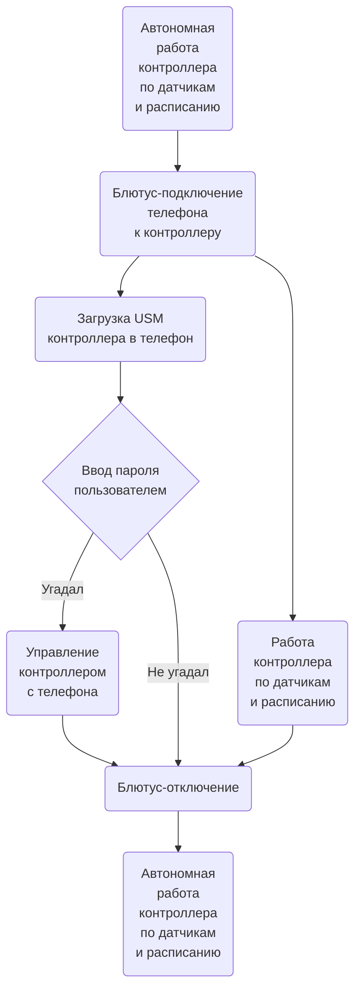
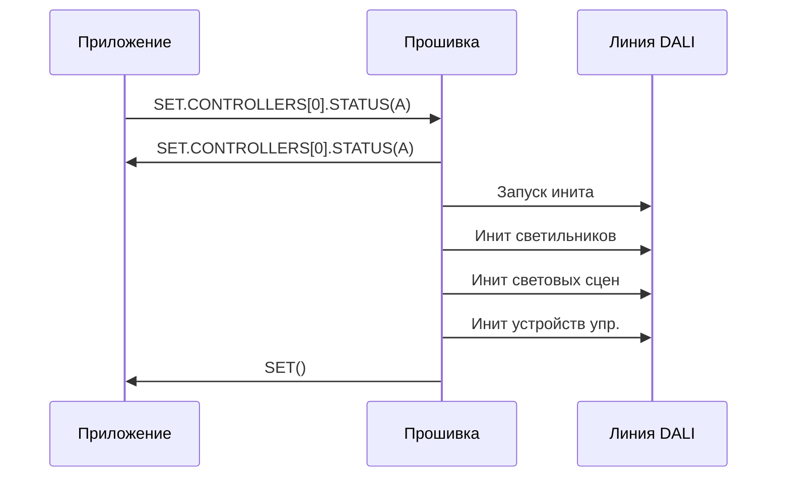

# Прошивка. Логика работы

АПК Синапс v1.0. ПО. Спецификации на разработку

**Последнее изменение:** 09.12.2025

## 1. Термины и определения

1.1. **Прошивка** — firmware в контроллере.

1.2. **Приложение** — интерфейсное мобильное приложение в телефоне.

1.3. **LLM** — Large Language Model (большая языковая модель).

1.4. **USM** (Unit System Model) — виртуальная модель системы освещения.

1.5. **USML** (Unit System Model Language) — система команд (телеграмм) для передачи данных в рамках АПК Синапс. Описано в SynapsePDS_USML.

1.6. **База данных прошивки** — разложенные по массивам структур Си «таблицы» с данными контроллера, светильников, датчиков и т.д. В описании логики называются таблицами, хотя и ежу понятно, что фактически формат хранения у них другой. Описано в SynapsePDS_FW_DB.

## 2. Взаимодействие с телефоном

2.1. С мобильным приложением прошивка работает через Bluetooth.

2.2. К контроллеру могут подключаться и параллельно работать с прошивкой до 4 телефонов. В перспективе. Пока один.

2.3. Общение между приложением и прошивкой идёт через телеграммы.

2.4. Прошивке без разницы, сколько приложений со своих телефонов подключились к контроллеру и работают с ней:
- приём телеграмм идёт как будто от одного устройства
- передача производится широковещательно

2.5. Схема взаимодействия в общих чертах:

## 3. Загрузка USM контроллера в телефон

3.1. После установки блютус-соединения ещё до проверки пользователя на знание пароля контроллер передаёт свою USM в приложение.

3.2. Передача производится USML-телегой `SET(...)`.

3.3. Т.о. в приложении оказывается своя копия USM-данных контроллера.

## 4. Пуско-наладочные работы

### 4.1. Сохранение IDATA

4.1.1. Когда пользователь меняет что-то из чисто интерфейсных вещей, которые никак в управлении освещением не участвуют (например, меняет название светильника), это надо сохранить для потомков в контроллере в блоке IDATA.

4.1.2. Передача интерфейсных данных с телефона на контроллер производится телегой `SET.CONTROLLERS[0].IDATA(...)`.

4.1.3. При получении её прошивка сохраняет данные в память и шлёт ту же телегу назад.

### 4.2. Инициализация линии DALI

4.2.1. При запуске пользователем инициализации линии DALI происходит следующее:
- В USM контроллера очищается всё кроме имени, иконки и пароля контроллера.
- В линии DALI происходит полный INITIALISE светильников и устройств управления.
- Согласно набору найденных устройств создаётся новая USM.
- Световые сцены 0..4 инициализируются начальными значениями.
- Новая версия USM передаётся в приложение.

4.2.2. Никакие локации и группы при этом не создаются. Все устройства помещаются вне локаций в «корень». Их LOCATION_ID = -1.

4.2.3. Порядок инициализации:

- Прошивка получает от приложения телегу `SET.CONTROLLERS[0].STATUS(I)`.

- Сама отвечает приложению телегой `SET.CONTROLLERS[0].STATUS(I)`.

- Очищаются все таблицы кроме **CONTROLLERS** (поля EXIST выставляются в F). Все байты в IDATA сбрасываются в 0.

- В единственной записи **CONTROLLERS** устанавливаются:
    - NAME - не меняется
    - PASSWORD - не меняется
    - ICO_NUM - не меняется
    - IS_SCHEDULE = F
    - IS_AUTO = F
    - STATUS = A
    - SCENE_NUM = -1

- Широковещательно выключаются в линии все светильники и светодиоды кнопочных панелей.

- Все устройства в линии DALI сбрасываются в состояние RESET.

- Раздаются короткие DALI-адреса светильникам. Светильник, получивший адрес, включается на макс.

- Светильники добавляются в таблицу **LUMINAIRES** с **LOCATION_ID = -1** (без локации, в корне).

- В светильники в линии DALI записываются значения для сцен 0..4.
    - реле (тип 7) яркость: 0 — 0%, 1..4 — 100%
    - диммируемые светодиодные (тип 6) яркости: 0, 25, 50, 75, 100% соответственно
    - RGB, RGBW (тип 8): красный цвет яркостью от 0, 25, 50, 75, 100%
    - TW (тип 8) яркости: 0, 25, 50, 75, 100% соответственно и температуру везде 4000K

- Параллельно с инициализацией сцен в линии DALI инициализируется таблица **SCENE_LUMINAIRES**.

- Раздаются короткие DALI-адреса устройствам управления.

- Устройства управления добавляются в таблицы **BUTTON_PANELS**, **BUTTONS**, **PRES_SENSORS**, **BRIGHT_SENSORS** с **LOCATION_ID = -1** (без локации, в корне).

- Статус в CONTROLLERS.STATUS устанавливается в A.

- Отправляется телега приложению: `SET(...)`.

### 4.3. Расширение линии DALI

4.3.1. Производится аналогично инициализации, только без сброса текущих настроек.

4.3.2. Новые устройства добавляются с LOCATION_ID = -1, т.е. без локации, в «корень».

### 4.4. Замена устройства в линии DALI

4.4.1. Замена вышедшего из строя устройства на новое того же типа с сохранением всех настроек старого.

4.4.2. Порядок замены:
- От приложения в прошивку приходит телега `SET.<TBLNAME>[<DEVID>].STATUS("C")`.
- Контроллер отправляет приложению телегу `SET.CONTROLLER[0].STATUS(I)`.
- Контроллер проводит магический обряд по замене.
- Контроллер отправляет приложению телегу `SET.<TBLNAME>[<DEVID>].STATUS(A)`.
- Контроллер отправляет приложению телегу `SET.CONTROLLER[0].STATUS(A)`.

### 4.5. Создание и удаление локаций, распределение по ним устройств

4.5.1. Создание: `SET.LOCATIONS[<LOCID>].EXIST(T)`. Прошивка производит изменения у себя в USM и отправляет телегу приложению.

4.5.2. Удаление: `SET.LOCATIONS[<LOCID>].EXIST(F)`. Прошивка производит изменения у себя в USM и отправляет телегу приложению. Кроме выставления EXIST = F у LOCATIONS[<LOCID>] надо ещё во все причастные устройства прописать LOCATION_ID = -1.

4.5.3. Помещение устройств в локацию производится поштучно телегами `SET.<TBL>[<DEVID>].LOCATION_ID(<LOCID>)`.

4.5.4. Перемещение из локации в корень: то же самое, но <LOCID> ставим -1.

### 4.6. Создание и удаление групп, распределение по ним устройств

4.6.1. Создание: `SET.GROUPS[<GRPID>].EXIST(T)`. Прошивка производит изменения у себя в USM и отправляет телегу приложению.

4.6.2. Удаление: `SET.GROUPS[<GRPID>].EXIST(F)`. Прошивка производит изменения у себя в USM и отправляет телегу приложению. Кроме выставления EXIST = F у GROUPS[<GRPID>] надо ещё во все причастные устройства прописать GROUP_ID = -1.

4.6.3. Помещение устройств в группу производится поштучно телегами `SET.<TBL>[<DEVID>].GROUP_ID(<GRPID>)`.

4.6.4. Перемещение из группы: то же самое, но <GRPID> ставим -1.

### 4.7. Именование и раздача пиктограмм контроллеру, локациям, устройствам

4.7.1. Всё это — интерфейсные данные, поэтому передаются телегой `SET.CONTROLLERS[0].IDATA(...)` в прошивку, а после изменения в прошивке назад этой же телегой в приложение.

### 4.8. Добавление поддействия в действие

4.8.1. Эти манипуляции требуются при навешивании действий на кнопки и датчики, поэтому из соотв. разделов на текущий раздел мы будем позже ссылаться.

4.8.2. При добавлении в действие с ID = <ACTID> поддействия с ID = <SACTID> (OBJECT_TYPE, OBJECT_NUM, VALUE):
- в прошивку поступает `SET.SUBACTIONS[<SACTID>](...)`
- прошивка сохраняет это в своей USM
- прошивка отправляет ту же телегу `SET.SUBACTIONS[<SACTID>](...)` приложению

4.8.3. При удалении из действия поддействия с ID = <SACTID>:
- в прошивку поступает `SET.SUBACTIONS[<SACTID>].ACTION_ID(-1)`
- прошивка сохраняет это в своей USM
- прошивка отправляет ту же телегу `SET.SUBACTIONS[<SACTID>].ACTION_ID(-1)` приложению

### 4.9. Назначение действий на присутствие и отсутствие датчиков присутствия

4.9.1. При назначении действия с ID = <ACTID> на присутствие датчика ID = <PSID>:
- в прошивку поступает `SET.PRES_SENSORS[<PSID>].ACTION_OCCUPANCY_ID(<ACTID>)`
- прошивка выставляет у себя в USM у датчика ACTION_OCCUPANCY_ID = <ACTID>
- прошивка отправляет телегу `SET.PRES_SENSORS[<PSID>].ACTION_OCCUPANCY_ID(<ACTID>)`

4.9.2. Снятие действия с присутствия датчика делается аналогично, но с передачей в качестве <ACTID> -1.

4.9.3. Как добавляются поддействия в действие, см. выше **4.8. Добавление поддействия в действие**.

4.9.4. Аналогичные чудеса происходят при работе с ACTION_VACANCY_ID.

### 4.10. Привязка датчиков освещённости к группам светильников

4.10.1. При назначении группы с ID = <GRPID> на датчик освещённости ID = <BSID>:
- в прошивку поступает `SET.BRIGHT_SENSORS[<BSID>].GROUP_ID(<GRPID>)`
- прошивка выставляет у себя в USM у датчика GROUP_ID = <GRPID>
- прошивка отправляет назад ту же телегу `SET.BRIGHT_SENSORS[<BSID>].GROUP_ID(<GRPID>)`

4.10.2. Снятие группы с датчика производится аналогично, но передачей в качестве <GRPID> -1.

### 4.11. Назначение действий на настенные кнопки

4.11.1. Когда (**первым шагом**) мы вешаем на **короткое нажатие** кнопки с ID = <BID> набор действий (набор — потому как надо дать возможность перебирать эти действия каруселью):
- в прошивку поступает `SET.BUTTONS[<BID>].ACTION_SET_SHORT_NUM(<ASID>)`
- прошивка выставляет у себя в USM у кнопки ACTION_SET_SHORT_NUM = <ASID>
- прошивка отправляет назад ту же телегу `SET.BUTTONS[<BID>].ACTION_SET_SHORT_NUM(<ASID>)`

4.11.2. Снятие набора с **короткого нажатия** производится аналогично, но передачей в качестве <ASID> -1.

4.11.3. Потом добавляем в набор действия телегами:
- в прошивку поступает `SET.ACTIONS[<ACTID>].ACTION_SET_NUM(<ASID>)`
- прошивка выставляет у себя в USM у действия с ID = <ACTID> ACTION_SET_NUM = <ASID>
- прошивка отправляет назад ту же телегу `SET.ACTIONS[<ACTID>].ACTION_SET_NUM(<ASID>)`

4.11.4. Удаление действия из набора производится аналогично, но с <ASID> = -1.

4.11.5. Как (**третьим шагом**) добавляются поддействия в каждое действие из набора, см. выше **4.8. Добавление поддействия в действие**.

4.11.6. При назначении действия с ID = <ACTID> на **долгое нажатие** кнопки:
- в прошивку поступает `SET.BUTTONS[<BID>].ACTION_LONG_ID(<ACTID>)`
- прошивка выставляет у себя в USM у кнопки ACTION_LONG_ID = <ACTID>
- прошивка отправляет назад ту же телегу `SET.BUTTONS[<BID>].ACTION_LONG_ID(<ACTID>)`

4.11.7. Снятие действия с **долгого нажатия** производится аналогично, но передачей в качестве <ACTID> -1.

4.11.8. Как добавляются поддействия в действие, см. выше **4.8. Добавление поддействия в действие**.

## 5. Настройка

## 6. Оперативное управление

## 7. Работа по датчикам

## 8. Работа по расписанию

## 9. Сброс контроллера железной кнопкой

## 10. Индикация на контроллере

## 11. Вопросы

11.1. У нас ведь все команды (на задание яркости светильника и т.п.) в DALI идут от контроллера? Т.е., если всё отрабатывает нормально, контроллер всегда знает актуальное состояние устройства в линии?

11.2. Как лучше отправлять?
- одну телегу со всей записью и потом в обработчике это разбирать
- две телеги каждую с одним полем

## 12. Идеи

