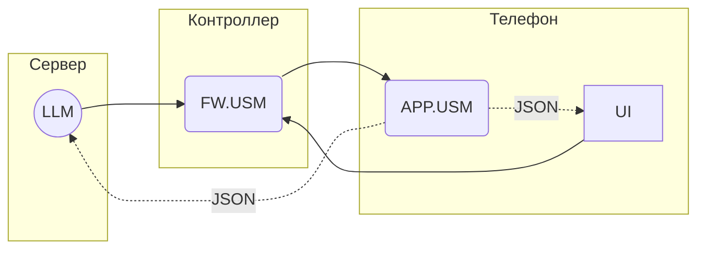

# Unit System Model Language

АПК Синапс v1.0. ПО. Спецификации на разработку

**Последнее изменение:** 08.12.2025

## 1. Термины и определения

1.1. **USM** (Unit System Model) — виртуальная модель системы освещения.

1.2. **USML** (Unit System Model Language) — система команд (телеграмм) для обмена данными с экземплярами USM.

1.3. **Телеграмма**, она же **телега** — название команды в USML, названная так, дабы отличать их от других команд.

1.4. **АПК** — аппаратно-программный комплекс Синапс.

## 2. Общие моменты

2.1. Обмен USML-телеграммами:



2.2. Экземпляр USM в приложении (APP.USM) — своего рода кэш USM контроллера (FW.USM). Так же как USM контроллера хранит состояние устройств DALI, чтобы за ним каждый раз не лазать в линию, так и USM в приложении нужен для оперативного получения состояния системы LLM'кой и UI.

2.3. Команды на изменение своего состояния FW.USM получает от LLM и UI.

2.4. Изменив своё состояние, FW.USM отправляет телеги об этом в APP.USM всех телефонов, которые в данный момент подключены к контроллеру.

## 3. Формат телеграмм

### 3.1. SET

Передача части USM в виде блока байтов. Обработчик этой телеги не только может менять состояние своей БД, но и выполнять другие действия. В частности FW.USM, получив телегу и изменив по данным в ней состояние своей БД, должен отправить соотв телегу SET в APP.USM дабы совершить акт экспликации.

`SET.TABLE[ID].FIELD(Content)`

где:  
  
- **TABLE[ID]** - ограничение Content по таблице:  
    - все таблицы - вся USM без ограничений: опускается (пример: `SET(..)`)  
    - вся таблица: TABLE[] (пример: `SET.LOCATION[](..)`)  
    - запись таблицы по PK ID: TABLE[ID] (пример: `SET.LOCATION[4](..)`)  

- **FIELD** - ограничение Content по полю записи:
    - вся запись: опускается (пример: `SET.LOCATION[4](..)`)  
    - поле записи: FIELD (пример: `SET.LOCATION[4].NAME(..)`)  

- **Content** - блок байтов; часть данных USM, ограничиваемая TABLE и FIELD;  
   
Т.о. в телеге может отсутствовать как TABLE так и FIELD, но если есть FIELD должна быть и TABLE. Более того, в последнем случае должна быть конкретизирована запись таблицы, передать значения какого-то поля всех записей таблицы нельзя.

Варианты / примеры:

1. `SET(уокр298498ап3цпп п3к укп кпцпу пкупцкпвам)` - вся USM
2. `SET.LOCATION[](пукп уа ум9п98  п9889 ап)` - вся таблица LOCATION
3. `SET.LOCATION[7](пукп уа ум9)` - запись таблицы LOCATION с ID = 7
4. `SET.LOCATION[7].NAME(Хрень)` - значение поля NAME в записи таблицы LOCATION с ID = 7

### 3.2. Формат блока Content

3.2.1. При формировании Content в него суются последовательно в порядке, указанном ниже, значения полей без разделителей непосредственно в их байтовом представлении.

3.2.2. Важен порядок, в котором в Content добавляются таблицы, записи, поля записей, и размер типов добавляемых значений. Чтобы кто-то правильно прочитал, кто-то должен сначала правильно записать!

3.2.3. Вот единственно верный порядок-структура (с указанием размера в байтах каждого поля):

**CONTROLLERS**
- **ID** (2)
- **NAME** (20)
- **PASSWORD** (4)
- **IS_SCHEDULE** (1)
- **IS_AUTO** (1)
- **ICO_NUM** (1)
- **STATUS** (1)
- **SCENE_NUM** (1)
- **IDATA** (50000)

**LOCATIONS**
- **ID** (2)
- **EXIST** (1)
- **IS_AUTO** (1)
- **SCENE_NUM** (1)

**GROUPS**
- **ID** (2)
- **EXIST** (1)
- **LOCATION_ID** (2)
- **SCENE_NUM** (1)

**LUMINAIRES**
- **ID** (2)
- **EXIST** (1)
- **DALI_ADDR** (1)
- **LOCATION_ID** (2)
- **GROUP_ID** (2)
- **VAL_BRIGHT** (1)
- **VAL_TW** (1)
- **VAL_R** (1)
- **VAL_G** (1)
- **VAL_B** (1)
- **VAL_W** (1)
- **SCENE_NUM** (1)
- **STATUS** (1)

**SCENE_LUMINAIRES**
- **ID** (2)
- **SCENE_NUM** (1)
- **LUMINAIRE_ID** (1)
- **VAL_BRIGHT** (1)
- **VAL_TW** (1)
- **VAL_R** (1)
- **VAL_G** (1)
- **VAL_B** (1)
- **VAL_W** (1)

**PRES_SENSORS**
- **ID** (2)
- **EXIST** (1)
- **DALI_ADDR** (1)
- **DALI_INST** (1)
- **LOCATION_ID** (2)
- **ACTION_OCCUPANCY_ID** (2)
- **ACTION_VACANCY_ID** (2)
- **DELAY** (1)
- **STATUS** (1)

**BRIGHT_SENSORS**
- **ID** (2)
- **EXIST** (1)
- **DALI_ADDR** (1)
- **DALI_INST** (1)
- **LOCATION_ID** (2)
- **GROUP_ID** (2)
- **STATUS** (1)

**BUTTON_PANELS**
- **ID** (2)
- **EXIST** (1)
- **DALI_ADDR** (1)
- **LOCATION_ID** (2)
- **STATUS** (1)

**BUTTONS**
- **ID** (2)
- **BUTTON_PANEL_ID** (2)
- **DALI_INST** (1)
- **ACTION_SET_SHORT_NUM** (2)
- **ACTION_LONG_ID** (2)

**ACTIONS**
- **ID** (2)
- **ACTION_SET_NUM** (2)
- **POS** (1)

**SUBACTIONS**
- **ID** (2)
- **ACTION_ID** (2)
- **OBJECT_TYPE** (1)
- **OBJECT_NUM** (1)
- **VALUE** (1)

**EVENTS**
- **ID** (2)
- **EXIST** (1)
- **DAYS** (7)
- **TIME** (4)
- **SMOOTH** (1)
- **ACTION_SET_ID** (2)

### 3.3. JSON-представление структуры Content

```json
{
  "VERSION": 3,
  "CONTROLLERS": {
    "ID": 2,
    "NAME": 20,
    "PASSWORD": 4,
    "IS_SCHEDULE": 1,
    "IS_AUTO": 1,
    "ICO_NUM": 1,
    "STATUS": 1,
    "SCENE_NUM": 1,
    "IDATA": 50000
  },
  "LOCATIONS": {
    "ID": 2,
    "EXIST": 1,
    "IS_AUTO": 1,
    "SCENE_NUM": 1
  },
  "GROUPS": {
    "ID": 2,
    "EXIST": 1,
    "LOCATION_ID": 2,
    "SCENE_NUM": 1
  },
  "LUMINAIRES": {
    "ID": 2,
    "EXIST": 1,
    "DALI_ADDR": 1,
    "LOCATION_ID": 2,
    "GROUP_ID": 2,
    "VAL_BRIGHT": 1,
    "VAL_TW": 1,
    "VAL_R": 1,
    "VAL_G": 1,
    "VAL_B": 1,
    "VAL_W": 1,
    "SCENE_NUM": 1,
    "STATUS": 1
  },
  "SCENE_LUMINAIRES": {
    "ID": 2,
    "SCENE_NUM": 1,
    "LUMINAIRE_ID": 1,
    "VAL_BRIGHT": 1,
    "VAL_TW": 1,
    "VAL_R": 1,
    "VAL_G": 1,
    "VAL_B": 1,
    "VAL_W": 1
  },
  "PRES_SENSORS": {
    "ID": 2,
    "EXIST": 1,
    "DALI_ADDR": 1,
    "DALI_INST": 1,
    "LOCATION_ID": 2,
    "ACTION_OCCUPANCY_ID": 2,
    "ACTION_VACANCY_ID": 2,
    "DELAY": 1,
    "STATUS": 1
  },
  "BRIGHT_SENSORS": {
    "ID": 2,
    "EXIST": 1,
    "DALI_ADDR": 1,
    "DALI_INST": 1,
    "LOCATION_ID": 2,
    "GROUP_ID": 2,
    "STATUS": 1
  },
  "BUTTON_PANELS": {
    "ID": 2,
    "EXIST": 1,
    "DALI_ADDR": 1,
    "LOCATION_ID": 2,
    "STATUS": 1
  },
  "BUTTONS": {
    "ID": 2,
    "BUTTON_PANEL_ID": 2,
    "DALI_INST": 1,
    "ACTION_SET_SHORT_NUM": 2,
    "ACTION_LONG_ID": 2
  },
  "ACTIONS": {
    "ID": 2,
    "ACTION_SET_NUM": 2,
    "POS": 1
  },
  "SUBACTIONS": {
    "ID": 2,
    "ACTION_ID": 2,
    "OBJECT_TYPE": 1,
    "OBJECT_NUM": 1,
    "VALUE": 1
  },
  "EVENTS": {
    "ID": 2,
    "EXIST": 1,
    "DAYS": 7,
    "TIME": 4,
    "SMOOTH": 1,
    "ACTION_SET_ID": 2
  }
}
```

## 4. Вопросы

## 5. Идеи
