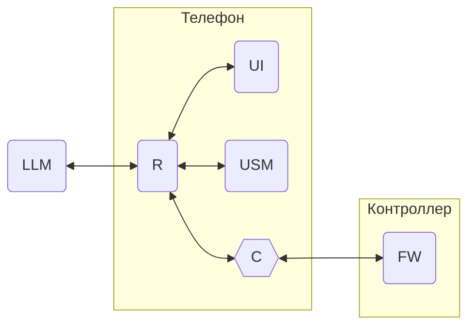

# Unit System Model Language

АПК Синапс v1.0. ПО. Спецификации на разработку

**Последнее изменение:** 01.12.2025

## 1. Термины и определения

1.1. **USML** (Unit System Model Language) — система команд (телеграмм) для передачи данных в рамках АПК Синапс. Предназначен для общения LLM, мобильного приложения и прошивки контроллера.

1.2. **Телеграмма**, она же **телега** — название команды в USML, названная так, дабы отличать их от других команд.

1.3. **Внешние телеграммы** — телеграммы между телефоном и контроллером.

1.4. **Внутренние телеграммы** — телеграммы между программными модулями USM и UI в приложении и LLM.

## 2. Общие моменты

2.1. Обмен телеграммами:

Где:  

USM — база данных, содержащая модель системы устройств в линии DALI  
LLM — нейронка  
UI — пользовательский кнопочный интерфейс  
C — конвертер НОРМАЛЬНЫЕ_ТЕЛЕГИ / ТЕЛЕГИ_FW  
FW — firmware, прошивка в контроллере  

2.2. Телеграммы в формате, описанном ниже, имеют хождение только со стороны приложения до конвертера. В конвертере они и на вход из прошивки, и на выход в прошивку переконвертируются в формат, одному богу и отделу Саенко известный.

## 3. Формат телеграмм

3.1. Телега представляет собой текстовый блок, начинающийся с символа [ и заканчивающийся ].

3.2. Встречающиеся в теле телеги [ и ] экранируются "\" перед ними.

3.3. Тело телеги имеет вид XXX.YYY_ZZZ(P1,P2,...Pn), где:
- XXX — адресат: LLM, UI, USM или FW
- YYY — объект: CONTR, LUM, PSENS, BSENS и т.д.
- ZZZ — действие: GET, SET и т.п.
- P — параметры (их набор зависит от трёх позиций выше) имеют следующие типы:
  - **NM** — целые числа в виде текстовых последовательностей цифр: 123;
  - **TX** — тексты, помещённые в двойные кавычки: "Лампочка 12" (кавычки в тексте экранируются \");
  - **TF** — T / F: T;
  - **DT** — бинарные блоки в Base64.

3.4. Пример телеги: [FW.CONTR_SET_NAME("Этаж 2")]

3.5. Парсер принимает и понимает очередной элемент в телеге на основе последовательности ранее принятых элементов. Например:  

[  
**FW** — прошивка должна  
**CONTR** — у контроллера  
**SET_NAME** — установить имя    
**"Этаж 2"** —  "Этаж 2"   
]  

## 4. Телеграммы к FW — работа с прошивкой

### 4.1. DALI_ — работа с линией DALI

**DALI_INIT**() — команда на запуск инициализации линии  
Пример: [FW.DALI_INIT()]

**DALI_INIT_STATUS**(TX STATUS) — команда со статусом инициализации  
STATUS: START, LUM_READY, FINISH  
Пример:  
[USM.DALI_INIT_STATUS(LUM_READY)]

### 4.2. CONTR_ — работа с контроллером  

**CONTR_GET_NAME**() — запрос данных контроллера: название    
Пример: [FW.CONTR_GET_NAME()]  

**CONTR_GET_PASSWORD**() — запрос данных контроллера: пароль     
Пример: [FW.CONTR_GET_PASSWORD()] 

**CONTR_GET_IS_SCHEDULE**() — запрос данных контроллера: работа по расписанию   
Пример: [FW.CONTR_GET_IS_SCHEDULE()] 

**CONTR_GET_ICO_NUM**() — запрос данных контроллера: номер иконки    
Пример: [FW.CONTR_GET_ICO_NUM()] 

**CONTR_GET_INTERFACE_DATA**() — запрос данных контроллера: интерфейсные данные   
Пример: [FW.CONTR_GET_INTERFACE_DATA()] 

**CONTR_SET_NAME**(TX NAME) — изменение данных контроллера: название   
Пример:   
[FW.CONTR_SET_NAME("Дом")]   

**CONTR_SET_PASSWORD**(TX PASSWORD) — изменение данных контроллера: пароль   
Пример:   
[FW.CONTR_SET_PASSWORD("1234")]

**CONTR_SET_IS_SCHEDULE**(TF IS_SCHEDULE) — изменение данных контроллера: работа по расписанию    
Пример:   
[FW.CONTR_SET_IS_SCHEDULE(F)]

**CONTR_SET_ICO_NUM**(NM ICO_NUM) — изменение данных контроллера: номер иконки   
Пример:   
[FW.CONTR_SET_ICO_NUM(8)]

**CONTR_SET_INTERFACE_DATA**(DT INTERFACE_DATA) — изменение данных контроллера: интерфейсные данные   
Пример:   
[FW.CONTR_SET_INTERFACE_DATA(IGRpb)]

## 5. Телеграммы к USM — работа с USM

## 6. Телеграммы к UI — работа с пользовательским интерфейсом

## 7. Телеграммы к LLM — работа с нейросетью через чат

## 8. Вопросы

## 9. Идеи
