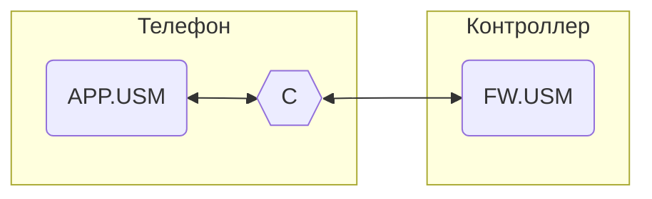

# Unit System Model Language

АПК Синапс v1.0. ПО. Спецификации на разработку

**Последнее изменение:** 05.12.2025

## 1. Термины и определения

1.1. **USM** (Unit System Model) — виртуальная модель системы освещения.

1.2. **USML** (Unit System Model Language) — система команд (телеграмм) для обмена данными между экземплярами USM.

1.3. **Телеграмма**, она же **телега** — название команды в USML, названная так, дабы отличать их от других команд.

1.4. **АПК** — аппаратно-программный комплекс Синапс.

## 2. Общие моменты

2.1. USM может как сама получать телеграммы USML и менять своё состояние, так и отправлять их, транслируя тем самым своё состояние в другую USM.

2.2. В рамках АПК обмен USML-телегами происходит между Телефон.USM (экземпляр USM в мобильном приложении) и Контроллер.USM (экземпляр USM в прошивке контроллера), т. е. по сути это экспликация двух БД.

2.1. Обмен телеграммами:

Где:  

APP.USM — экземпляр USM в приложении   
FW.USM — экземпляр USM в прошивке  
C — конвертер НОРМАЛЬНЫЕ_ТЕЛЕГИ / ТЕЛЕГИ_FW (телеги USML во внутреннем формате прошивки)  

## 3. Формат телеграмм

**SET.DOMAIN1.DOMAIN2(Content)**

где:  
- **SET** - должна же телега с чего-то начинаться; не понятно будет ли GET, но пока только SET  
- **DOMAINx** - домен одного из трех видов в терминах БД:  
    - **поле** - поле таблицы;  
        - пример: NAME;  
        - всегда последний домен, т.к. у него нет вложений;  
        - в Content значение поля конкретной записи или всех значений поля в таблице;  
        - типы: char(LENGTH), uint8_t, short, BLOB(LENGTH))  
    - **запись** - запись таблицы;  
        - пример: LOCATIONS[4];  
        - за ним может идти домен с полем, тогда в Content значение поля, иначе вся запись  
    - **таблица** - таблица;  
        - пример: LOCATIONS;  
        - за ним может идти поле, тогда в Content все значения поля в таблице, иначе в Content вся таблица  
- **Content** - блок байтов  
    - данные с собержимым того, что передается;  
    - длина и структура определяется набором предыдущих доменов   

## 8. Вопросы

## 9. Идеи
