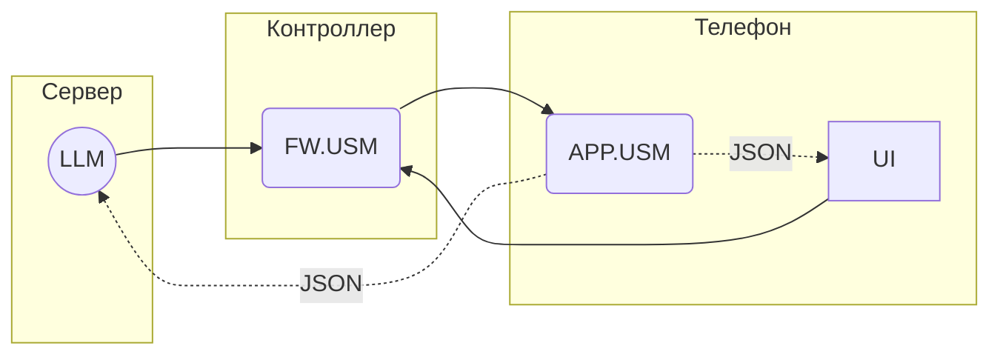

# Unit System Model Language

АПК Синапс v1.0. ПО. Спецификации на разработку

**Последнее изменение:** 06.12.2025

## 1. Термины и определения

1.1. **USM** (Unit System Model) — виртуальная модель системы освещения.

1.2. **USML** (Unit System Model Language) — система команд (телеграмм) для обмена данными с экземплярами USM.

1.3. **Телеграмма**, она же **телега** — название команды в USML, названная так, дабы отличать их от других команд.

1.4. **АПК** — аппаратно-программный комплекс Синапс.

## 2. Общие моменты

2.1. Обмен USML-телеграммами:

## 3. Формат телеграмм

### 3.1. SET

Передача части USM в виде блока байтов. 

**SET.TABLE[ID].FIELD(Content)**

где:  
  
- **TABLE[ID]** - ограничение Content по таблице:  
    - все таблицы - вся USM без ограничений: опускается (пример: SET(..))  
    - вся таблица: TABLE[] (пример: SET.LOCATION\)  
    - запись таблицы по PK ID: TABLE[ID] (пример: SET.LOCATION\[4](..))  

- **FIELD** - ограничение Content по полю записи:
    - вся запись: опускается (пример: SET.LOCATION\[4](..))  
    - поле записи: FIELD (пример: SET.LOCATION\[4].NAME(..))  

- **Content** - блок байтов; часть данных USM, ограничиваемая TABLE и FIELD;  
   
Т.о. в телеге может отсутсвовать как TABLE так и FIELD, но если есть FIELD должна быть и TABLE. Более того, в последнем случае должна быть конкретизирована запись таблицы, передать заначения какого-то поля всех записей таблицы нельзя.

Варианты / примеры:

1. SET(уокр298498ап3цпп п3к укп кпцпу пкупцкпвам) - вся USM
2. SET.LOCATION\ - вся таблица LOCATION
3. SET.LOCATION\[7](пукп уа ум9) - запись таблицы LOCATION с ID = 7
4. SET.LOCATION\[7].NAME(Хрень) - значение поля NAME в записи таблицы LOCATION с ID = 7

## 8. Вопросы

## 9. Идеи
