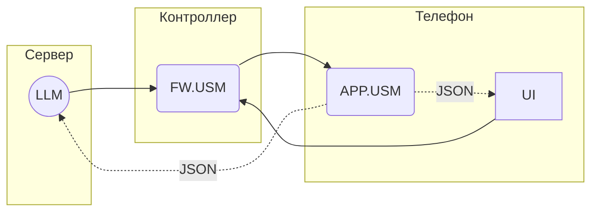

# Unit System Model Language

АПК Синапс v1.0. ПО. Спецификации на разработку

**Последнее изменение:** 07.12.2025

## 1. Термины и определения

1.1. **USM** (Unit System Model) — виртуальная модель системы освещения.

1.2. **USML** (Unit System Model Language) — система команд (телеграмм) для обмена данными с экземплярами USM.

1.3. **Телеграмма**, она же **телега** — название команды в USML, названная так, дабы отличать их от других команд.

1.4. **АПК** — аппаратно-программный комплекс Синапс.

## 2. Общие моменты

2.1. Обмен USML-телеграммами:

2.2. Экземпляр USM в приложении (APP.USM) — своего рода кэш USM контроллера (FW.USM). Так же как USM контроллера хранит состояние устройств DALI, чтобы за ним каждый раз не лазать в линию, так и USM в приложении нужен для оперативного получения состояния системы LLM'кой и UI.

2.3. Команды на изменение своего состояния FW.USM получает от LLM и UI.

2.4. Изменив своё состояние, FW.USM отправляет телеги об этом в APP.USM всех телефонов, которые в данный момент подключены к контроллеру.

## 3. Формат телеграмм

### 3.1. SET

Передача части USM в виде блока байтов. 

**SET.TABLE[ID].FIELD(Content)**

где:  
  
- **TABLE[ID]** - ограничение Content по таблице:  
    - все таблицы - вся USM без ограничений: опускается (пример: SET(..))  
    - вся таблица: TABLE[] (пример: SET.LOCATION\)  
    - запись таблицы по PK ID: TABLE[ID] (пример: SET.LOCATION\[4](..))  

- **FIELD** - ограничение Content по полю записи:
    - вся запись: опускается (пример: SET.LOCATION\[4](..))  
    - поле записи: FIELD (пример: SET.LOCATION\[4].NAME(..))  

- **Content** - блок байтов; часть данных USM, ограничиваемая TABLE и FIELD;  
   
Т.о. в телеге может отсутствовать как TABLE так и FIELD, но если есть FIELD должна быть и TABLE. Более того, в последнем случае должна быть конкретизирована запись таблицы, передать значения какого-то поля всех записей таблицы нельзя.

Варианты / примеры:

1. SET(уокр298498ап3цпп п3к укп кпцпу пкупцкпвам) - вся USM
2. SET.LOCATION\ - вся таблица LOCATION
3. SET.LOCATION\[7](пукп уа ум9) - запись таблицы LOCATION с ID = 7
4. SET.LOCATION\[7].NAME(Хрень) - значение поля NAME в записи таблицы LOCATION с ID = 7

### 3.2. Формат блока Content

3.2.1. При формировании Content важен порядок, в котором в него добавляются таблицы, записи, поля записей, и размер типов добавляемых значений. Чтобы кто-то правильно прочитал кто-то должен сначала правильно записать!

3.2.2. Вот единственно верный порядок-структура:

**CONTROLLERS**
- **ID** (short)
- **NAME** (char[20])
- **PASSWORD** (char[4])
- **IS_SCHEDULE** (char[1])
- **IS_AUTO** (char[1])
- **ICO_NUM** (uint8_t)
- **STATUS** (char[1])
- **SCENE_NUM** (uint8_t)
- **IDATA** (BLOB(50000))

**LOCATIONS**
- **ID** (short)
- **EXIST** (char[1])
- **IS_AUTO** (char[1])
- **SCENE_NUM** (uint8_t)

**GROUPS**
- **ID** (short)
- **EXIST** (char[1])
- **LOCATION_ID** (short)
- **DALI_NUM** (uint8_t)
- **SCENE_NUM** (uint8_t)

**LUMINAIRES**
- **ID** (short)
- **EXIST** (char[1])
- **DALI_ADDR** (uint8_t)
- **LOCATION_ID** (short)
- **GROUP_ID** (short)
- **VAL_BRIGHT** (uint8_t)
- **VAL_TW** (uint8_t)
- **VAL_R** (uint8_t)
- **VAL_G** (uint8_t)
- **VAL_B** (uint8_t)
- **VAL_W** (uint8_t)
- **SCENE_NUM** (uint8_t)
- **STATUS** (char[1])

**SCENE_LUMINAIRES**
- **ID** (short)
- **SCENE_NUM** (uint8_t)
- **LUMINAIRE_ID** (uint8_t)
- **VAL_BRIGHT** (uint8_t)
- **VAL_TW** (uint8_t)
- **VAL_R** (uint8_t)
- **VAL_G** (uint8_t)
- **VAL_B** (uint8_t)
- **VAL_W** (uint8_t)

**PRES_SENSORS**
- **ID** (short)
- **EXIST** (char[1])
- **DALI_ADDR** (uint8_t)
- **DALI_INST** (uint8_t)
- **LOCATION_ID** (short)
- **ACTION_OCCUPANCY_ID** (short)
- **ACTION_VACANCY_ID** (short)
- **DELAY** (uint8_t)
- **STATUS** (char[1])

**BRIGHT_SENSORS**
- **ID** (short)
- **EXIST** (char[1])
- **DALI_ADDR** (uint8_t)
- **DALI_INST** (uint8_t)
- **LOCATION_ID** (short)
- **GROUP_ID** (short)
- **STATUS** (char[1])

**BUTTON_PANELS**
- **ID** (short)
- **EXIST** (char[1])
- **DALI_ADDR** (uint8_t)
- **LOCATION_ID** (short)
- **STATUS** (char[1])

**BUTTONS**
- **ID** (short)
- **EXIST** (char[1])
- **BUTTON_PANEL_ID** (short)
- **DALI_INST** (uint8_t)
- **ACTION_SET_SHORT_ID** (short)
- **ACTION_LONG_ID** (short)

**ACTIONS**
- **ID** (short)
- **EXIST** (char[1])
- **ACTION_SET_ID** (short)
- **POS** (uint8_t)

**SUBACTIONS**
- **ID** (short)
- **EXIST** (char[1])
- **ACTION_ID** (short)
- **OBJECT_TYPE** (uint8_t)
- **OBJECT_NUM** (uint8_t)
- **VALUE** (uint8_t)

**ACTION_SETS**
- **ID** (short)
- **EXIST** (char[1])

**EVENTS**
- **ID** (short)
- **EXIST** (char[1])
- **DAYS** (char[7])
- **TIME** (char[4])
- **SMOOTH** (char[1])
- **ACTION_SET_ID** (short)

## 4. Вопросы

## 5. Идеи
