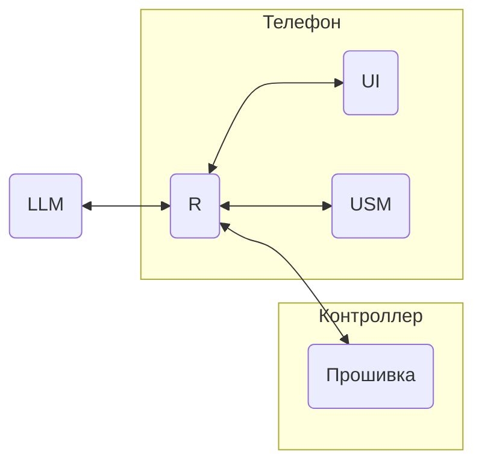

# Unit System Model Language

АПК Синапс v1.0. ПО. Спецификации на разработку

**Последнее изменение:** 24.11.2025

## 1. Термины и определения

1.1. **USML** (Unit System Model Language) — система команд (телеграмм) для передачи данных в рамках АПК Синапс. Предназначен для общения LLM, мобильного приложения и прошивки контроллера.

1.2. **Телеграмма**, она же **телега** — название команды в USML, названная так, дабы отличать их от других команд.

1.3. **Внешние телеграммы** — телеграммы между телефоном и контроллером.

1.4. **Внутренние телеграммы** — телеграммы между программными модулями USM и UI в приложении и LLM.

## 2. Общие моменты

2.1. Обмен телеграммами:

## 3. Формат телеграмм

3.1. Телега представляет собой текстовый блок в кодировке CP1251 (Windows-1251), начинающийся с символа [ и заканчивающийся ].

3.2. Встречающиеся в теле телеги [ и ] экранируются "\" перед ними.

3.3. Тело телеги имеет вид XXX.YYY_ZZZ(P1,P2,...Pn), где:
- XXX — адресат: LLM, UI, USM или FW
- YYY — объект: CONTR, LUM, PSENS, BSENS и т.д.
- ZZZ — действие: GET, SET и т.п.
- P — параметры (их набор зависит от трёх позиций выше) имеют следующие типы:
  - NM - целые числа в виде текстовых последовательностей цифр: 123;
  - TX - тексты, помещённые в двойные кавычки: "Лампочка 12" (кавычки в тексте экранируются \");
  - TF - T / F: T
  - DT - бинарные блоки в Base64.

3.4. Пример телеги: [FW.CONTR_SET(25,"Этаж 2",IGlzIGRpc3Rpbmd1aXNoZWQsIG5vdC)]

3.5. В целях сокращения размера кода в прошивке, парсящего и формирующего телеги, зарезервированные слова во **внешних** телегах заменяются на соответствующие им числа: [1.1_2(25,"Этаж 2",IGlzIGRpc3Rpbmd1aXNoZWQsIG5vdC)].

3.6. Программный модуль R перед отправкой телеги прошивке кодирует слова в числа, а при получении телеграммы от прошивки выполняет обратную процедуру.

3.7. Парсер принимает и понимает очередной элемент в телеге на основе последовательности ранее принятых элементов. Например:  

[  
**FW** (или 1) — прошивка должна  
**CONTR** (или 1) — у контроллера  
**SET** (или 2) — установить  
**25** — иконку с №25  
**"Этаж 2"** — название контроллера "Этаж 2"  
**IGlzIGRpc3Rpbmd1aXNoZWQsIG5vdC** — в блок с интерфейсными данными записать IGlzIGRpc3Rpbmd1aXNoZWQsIG5vdC  
]  

## 3. Телеграммы к FW (1) - работа с прошивкой

3.1 **CONTR** (1) - работа с контроллером  

Действия:  

**GET** (1) - запрос всех данных контроллера  
Параметры: без параметров  
Пример: [FW.CONTR_GET()]  

**SET** (2) - изменение данных контроллера  
Параметры: TX NAME, TX PASSWORD, TF IS_SCHEDULE, NM ICO_NUM, DT INTERFACE_DATA  
Пример: [FW.CONTR_SET("Офис","1234",F,8,IGRpc3Rpbmd1aXNoZWQs)]  

## 3. Телеграммы к USM*(2) - работа с USM (базой данных, содержащей модель системы устройств в линии DALI)

## 3. Телеграммы к UI (3) - работа с пользовательским интерфейсом

## 3. Телеграммы к LLM (4) - работа с нейросеткой через чат 

## 4. Вопросы

4.1. Двоичные блоки кодируем в Base64?

4.2. Кодировку для кириллицы используем CP1251 (Windows-1251)?

## 5. Идеи
