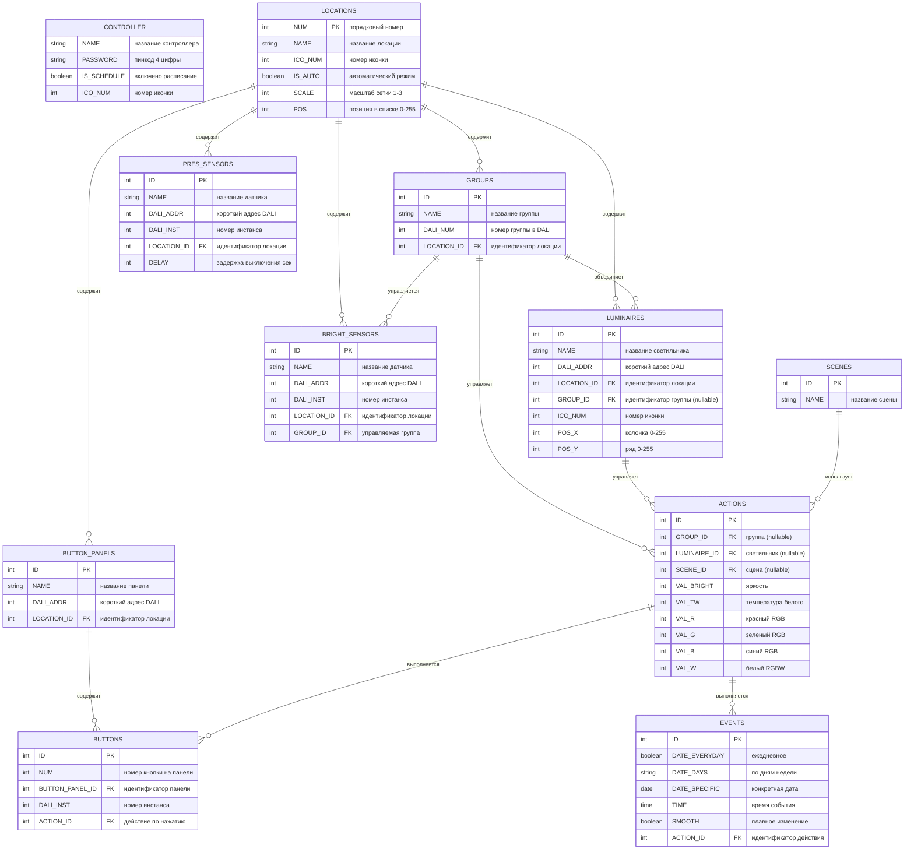

# Схема базы данных Synapse (Mermaid ERD)

## Легенда

**Жирным** в описании помечены рабочие поля (необходимые для работы освещения).

Остальные поля — интерфейсные (используются только приложением).

## Типы связей

- `||--o{` — один ко многим
- `(nullable)` — поле может быть NULL

## Основные сущности

1. **CONTROLLER** — настройки контроллера (одна запись)
2. **LOCATIONS** — помещения/локации
3. **GROUPS** — группы светильников
4. **LUMINAIRES** — отдельные светильники
5. **PRES_SENSORS** — датчики присутствия
6. **BRIGHT_SENSORS** — датчики освещённости
7. **BUTTON_PANELS** — кнопочные панели управления
8. **BUTTONS** — отдельные кнопки на панелях
9. **ACTIONS** — действия (изменение яркости, цвета и т.д.)
10. **EVENTS** — события расписания
11. **SCENES** — световые сцены

