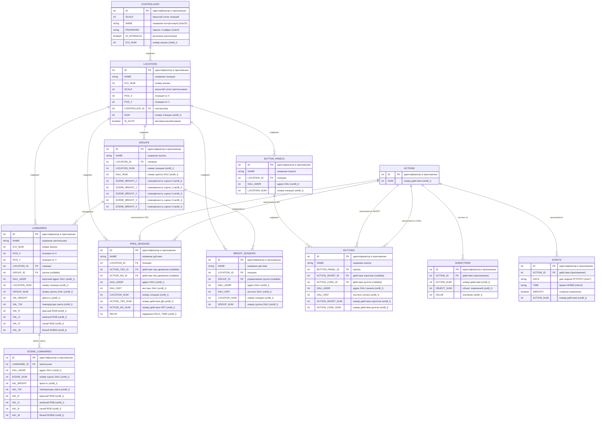

# Схема базы данных Synapse (Mermaid ERD)

## Легенда

**Жирным** в спецификации БД помечены рабочие поля (необходимые для работы освещения в прошивке).

Остальные поля — интерфейсные (используются только приложением).

## Типы связей

- `||--o{` — один ко многим
- `(nullable)` — поле может быть NULL

## Основные сущности

1. **CONTROLLERS** — настройки контроллера (одна запись в прошивке)
2. **LOCATIONS** — помещения/локации (до 16)
3. **LUMINAIRES** — отдельные светильники (до 64)
4. **SCENE_LUMINAIRES** — параметры светильников в сценах (до 320)
5. **GROUPS** — группы светильников (до 16)
6. **PRES_SENSORS** — датчики присутствия (до 64)
7. **BRIGHT_SENSORS** — датчики освещённости (до 64)
8. **BUTTON_PANELS** — кнопочные панели управления (до 64)
9. **BUTTONS** — отдельные кнопки на панелях (до 64)
10. **ACTIONS** — действия с устройствами (до 255)
11. **SUBACTIONS** — поддействия (детализация действий) (до 255)
12. **EVENTS** — события расписания (до 255)

## Особенности структуры

### Двойная система идентификации

Каждая таблица имеет два типа идентификаторов:

- **ID** — для приложения (SQLite)
- **NUM/DALI_ADDR** — для прошивки (массивы структур C)

### Действия и поддействия

- **ACTIONS** — контейнер действия с уникальным номером
- **SUBACTIONS** — конкретные команды внутри действия (изменение яркости, цвета, сцены и т.д.)

Одно действие может содержать несколько поддействий для управления разными объектами одновременно.

### Сцены светильников

- **SCENE_LUMINAIRES** — хранит параметры каждого светильника для каждой сцены
- Сцены программируются в DALI-устройствах
- Контроллер хранит копию для синхронизации между приложениями

### Датчики присутствия

Имеют два действия:

- **ACTION_YES** — при обнаружении движения
- **ACTION_NO** — при отсутствии движения (с задержкой DELAY)

### Кнопки

Каждая кнопка может иметь два действия:

- **ACTION_SHORT** — по короткому нажатию
- **ACTION_LONG** — по долгому нажатию

## Память в прошивке

Общий объём памяти для рабочих данных: **~8.5 КБ**

Самые большие таблицы:

- EVENTS — 3.3 КБ (38.3%)
- SCENE_LUMINAIRES — 2.5 КБ (29.5%)
- SUBACTIONS — 765 байт (8.8%)
