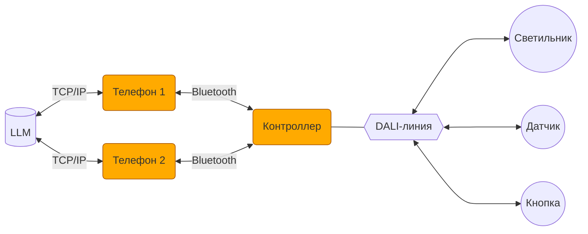

# Техническое задание
АПК Синапс v1.0. ПО

**Последнее изменение:** 24.11.2025

## 1. Назначение

1.1. Пуско-наладка, настройка, оперативное управление и автоматическая работа осветительного оборудования с применением стандарта DALI.

## 2. Функции комплекса

2.1. Пуско-наладочные работы с оборудованием, подключаемым к линии DALI.

2.2. Настройка режимов работы оборудования под требования пользователя.

2.3. Оперативное управление оборудованием.

2.4. Автоматическая работа освещения по датчикам присутствия и освещенности.

2.5. Работа оборудования по расписанию.

## 3. Термины и определения

3.1. **АПК** — аппаратно-программный комплекс.

3.2. **Контроллер** — устройство на базе микроконтроллера GD32F103RBT6, работающее с устройствами DALI.

3.3. **Устройство** — DALI-устройство в линии: светильник, датчик, кнопочная панель.

3.4. **Прошивка** — firmware в контроллере.

3.5. **Телефон** — мобильное устройство, обеспечивающее пользовательский интерфейс АПК.

3.6. **Приложение** — интерфейсное мобильное приложение в телефоне.

3.7. **LLM** — Large Language Model (большая языковая модель).

3.8. **Локация** — помещение или часть помещения с отдельно от других частей объекта организованной работой освещения. В АПК все локации одного уровня. Иерархия локаций не предусмотрена.

3.9. **Действие (ACTION)** — изменение состояния системы освещения. Действие — произвольный набор из команд (SUBACTION):
- включений сцен светильников, сцен групп, сцен локаций, сцен всего объекта;
- установка температуры TW у отдельного светильника, группы, локации или всего объекта;
- включений и выключений режима АВТО в локациях.  

Действия навешиваются на нажатия кнопок, сработки датчиков присутствия, события в расписании.  

3.10. **Оперативное управление** — ручная установка пользователем яркости, цвета и/или температуры света светильников; управление режимом АВТО в локациях.

3.11. **Настройка** — установка пользователем параметров устройств, активация/деактивация датчиков, задание расписания с целью приведения работы освещения под свои требования.

3.12. **ПНР** — первичное конфигурирование устройств после монтажа (инициализация линии DALI); установка параметров устройств, изменение которых конечными пользователями в процессе эксплуатации не предполагается (MIN LEVEL, MAX LEVEL и т. д.).

3.13. **Режим АВТО** — изменение освещения в локации на основе сигналов от датчиков. Включается/выключается тумблером на странице локации в приложении.

## 4. Пуско-наладка, настройка и оперативное управление. Разделение понятий

4.1. **Пуско-наладка**

- Инициализация линии DALI.
- Расширение линии DALI.
- Замена устройств в линии DALI.
- Создание локаций и распределение по ним устройств.
- Именование и раздача пиктограмм контроллеру, локациям, устройствам.
- Создание групп светильников.
- Назначение действий на присутствие и отсутствие датчиков присутствия.
- Привязка датчиков освещённости к группам светильников.
- Назначение действий на настенные кнопки.
- Установка у светильников: MIN_LEVEL, MAX_LEVEL.

4.2. **Настройка**

- Установка у светильников: FADE_TIME.
- Установка у датчиков присутствия: задержки (HOLD_TIME).
- Формирование, активация/деактивация расписания.
- Сохранение световых сцен у светильников, групп.

4.3. **Оперативное управление**

- Включение световых сцен у светильников, групп, локаций, всего контроллера.
- Изменение яркости, цвета, температуры света у отдельных светильников.
- Активация/деактивация режима АВТО у локации.

## 5. Аппаратная архитектура АПК

5.1. В АПК входят контроллер и один или несколько телефонов.

5.2. Телефоны подключаются к контроллеру по Bluetooth.

5.3. С контроллером одновременно могут работать (быть подключены) несколько телефонов.

5.4. К контроллеру подключается 1 линия DALI, устройствами в которой управляет АПК.

5.5. Телефон посредством интернет-соединения подключается к LLM, развернутой на сервере AWADA (или возможно в телефоне?).

## 6. Локации

6.1. Контроллер (если он проинициализирован) должен иметь не менее одной локации.

6.2. Каждое устройство привязывается к одной из локаций.

6.3. При инициализации создается одна локация, в которую помещаются все найденные в линии DALI устройства.

6.4. Создание других локаций и распределение устройств по ним происходит по командам от приложения.

6.5. Количество локаций: до 16.

6.6. Все локации находятся на одном уровне, никакой многоуровневой иерархии не предусмотрено.

6.7. У локации есть флаг — работает ли локация в автоматическом режиме по датчикам присутствия и освещённости. Если АВТО — выкл, сигналы от датчиков, меняющие освещение в данной локации, игнорируются.

## 7. Светильники

7.1. Количество светильников ограничено емкостью линии DALI: 64 шт.

7.2. Поддерживаемые типы светильников: реле, диммер, RGB, RGBW, TW.

7.3. Светильник должен находиться в одной из локаций.

## 8. Световые сцены

8.1. Световые (цветовые) сцены в АПК соответствуют DALI-сценам и используют DALI-механизм сцен.

8.2. 5 сквозных сцен (DALI-сцены 0–4) распространяются на все светильники.

8.3. По умолчанию в сценах 0–4 светильники имеют:
- яркость: 0, 25, 50, 75, 100%;
- цвет: красный с максимальной насыщенностью;

8.4. Состояние светильников в сцены может сохраняться:
- отдельным светильником;
- группой светильников.

8.5. Команда на включение сцены может быть отдана пользователем:
- отдельному светильнику;
- группе светильников;
- всем светильникам локации;
- всем светильникам контроллера.

8.6. Сцены локаций и контроллера наследуют настройки сцен светильников и групп т.к. 5 сцен сквозные.

## 9. Группы светильников

9.1. Светильники в рамках локации могут быть объединены в группы.

9.2. Группы в АПК соответствуют DALI-группам и используют DALI-механизм групп.

9.3. Общее максимальное количество групп на все локации — 16.

9.4. Светильник может входить только в одну группу или быть вне групп (чтобы отдельные светильники не занимали DALI-группы, которых на всех не хватит).

9.5. Светильники, объединённые в группу, получают возможность группового управления.

9.6. У светильников в группе остаётся возможность индивидуального управления и настройки.

## 10. Устройства управления

10.1. Количество устройств управления ограничено емкостью линии DALI: 64 шт.

10.2. Типы устройств управления: датчики присутствия и освещенности, кнопочные панели.

## 11. Кнопочные панели

11.1. Кнопочные панели — основной инструмент пользователя для оперативного управления освещением.

11.2. На **короткое нажатие** кнопки может быть повешено одно или несколько действий (ACTIONS, см. ниже):
- Если действие одно — при нажатии на кнопку оно и случается;
- Если действий несколько — они выполняются перебором.

11.3. На **долгое нажатие** можно повесить только одно действие (ACTION). При нажатии и удержании вкл/выкл АВТО-режима производится сразу, яркость светильников плавно меняется в направлении целевой сцены.

11.4. Действия можно вешать и на короткое, и на длинное нажатия одновременно.

## 12. Датчики присутствия

12.1. На датчик навешиваются два действия (ACTIONS, см. ниже): на присутствие / на отсутствие.

12.2. Действие на присутствие срабатывает, когда датчик регистрирует движение при отсутствии движения до этого.

12.3. Действие на отсутствие срабатывает, когда датчик регистрирует отсутствие присутствия.

12.4. Если есть желание деактивировать конкретный датчик присутствия — убираем у него действия.

12.5. Действие всех датчиков на отдельно взятую локацию может быть активировано/деактивировано тумблером АВТО у этой локации в приложении или настенной кнопкой с соответствующим ACTION Локация.Авто = OFF или через расписание.

12.6. Оперативное управление хотя бы одним светильником в локации временно переводит режим АВТО в этой локации в выключенное состояние. Возврат в режим Локация.Авто = ON в этом случае:
- любой датчик движения данной локации регистрирует движение;
- до этого момента ни один датчик движения не регистрировал движения.  

## 13. Датчики освещенности

13.1. К датчику может быть привязана одна и только одна группа светильников из той же локации, что и датчик.

13.2. Группа светильников может быть привязана только к одному датчику.

13.3. Если есть желание деактивировать конкретный датчик освещённости — убираем у него привязку к группе.

13.4. Действие всех датчиков на отдельно взятую локацию может быть активировано/деактивировано тумблером АВТО у этой локации в приложении или настенной кнопкой или через расписание.

13.5. Датчик по команде из приложения запоминает текущую освещённость как целевую для каждой из 5 сцен группы в момент сохранения каждой из сцен.

13.6. При привязке датчика освещенности к группе группа последовательно переводится в каждую из 5 сцен. В момент работы каждой сцены сохраняется её целевая освещённость (начальная установка).

13.7. Если при сохранении сцены (и, соответственно, задания целевой освещённости) светильник полностью выключен, он в подкрутке освещённости по датчику участвовать не будет.

13.8. Любое изменение яркости светильников в группе, отличное от включения одной из её 5 сцен, отключает подкрутку яркости в ней по датчику освещённости.

13.9. Включение у группы любым способом одной из её сцен переводит группу в режим поддержания целевой освещённости.

## 14. Действия

14.1. Действие (ACTION) — набор из команд (SUBACTIONS):
- включение сцены у отдельного светильника, группы, локации или всего объекта;
- установка температуры TW у отдельного светильника, группы, локации или всего объекта;
- включение/выключение режима АВТО у локации.

14.2. Навешиваются на нажатия кнопок, срабатывание датчиков присутствия, события расписания.

14.3. Действие может распространяться на любые локации и весь объект независимо от расположения инициирующего устройства.

## 15. Расписание

15.1. Расписание задается в виде набора событий (EVENTS), при возникновении каждого из которых выполняется действие (ACTION).

15.2. События могут быть ежедневными или назначаться на определённые дни недели.

15.3. Расписание одно для всего контроллера.

15.4. Расписание может быть активировано/деактивировано.

15.5. Необходимость действий (ACTIONS) по событиям расписания (EVENTS) проверяется контроллером раз в 1 минуту.

15.6. Если на одно время назначено и ежедневное событие и событие на день недели, сначала выполняется первое, затем второе.

15.7. На одно и то же время нельзя назначить для ежедневных событий и/или два события по дням недели.

15.8. Действие может производиться одномоментно (EVENTS.SMOOTH = F), когда параметры меняются шагово, и плавно (EVENTS.SMOOTH = T), когда параметры, меняемые у устройств, линейно изменяются от предыдущих значений к значениям, заданным в ACTIONS.

15.9. При плавном изменении параметров (SMOOTH = T) изменение производится раз в 1 минуту.

## 16. Контроллер

16.1. Контроллер хранит константы:
- серийник: XXXXXXXX (8 цифр);
- название в Bluetooth: SYNAPSE XXXXXXXX.

16.2. Контроллер хранит переменные (меняются через приложение):
- пароль: YYYY (4 цифры);
- название, под которым контроллер значится в приложении (по умолчанию SYNAPSE XXXXXXXX);
- номер иконки (по умолчанию дефолт — 0).

## 17. Прошивка

17.1. Возможность обновления прошивки с помощью приложения.

17.2. Текущие дата и время для расписания. Обновляются из приложения при каждом подключении телефона к контроллеру.

17.3. Данные в контроллере делятся на:

- **Рабочие** — для работы с оборудованием DALI; хранятся в структурах языка С; передаются в командах между прошивкой и приложением.
- **Интерфейсные** — для формирования интерфейса приложения (названия, номера иконок, расположение иконок и т. п.); хранятся единым блоком; передаются бинарным блоком между прошивкой и приложением.

17.4. Программная кнопка на контроллере, сбрасывающая:
- **долгим нажатием** настройки прошивки (не исполняемый код) в заводское состояние;
- **коротким нажатием** только пароль в заводской.

17.5. Автоматическая работа по датчикам и расписанию при соответствующих флагах, выставленных в локациях.

17.6. Опрос текущего состояния устройств в периоды затишья.

17.7. При отправке устройствам команд на изменение состояния последующий опрос того, подействовали ли эти команды, не предполагается. Выстрелили сообразно стандартам DALI и забыли. Сказали светильнику включиться на 33, считаем, что он включился на 33.

## 18. Прошивка. ПНР

18.1. Инициализация по команде от приложения линии DALI со сбросом настроек устройств к состоянию RESET.

18.2. При инициализации кроме DALI-настроек удаляются все локации (и создаётся одна, в которую все вновь найденные устройства складируются), устройства, группы, расписание.

18.3. Передача в приложение текущего статуса инициализации устройств для информирования пользователя о ходе процесса.

18.4. Перед инициализацией все устройства широковещательно выключаются (у кнопок и датчиков выключаются светодиоды). После успешной выдачи устройству короткого адреса DALI оно включается.

18.5. Добавление новых устройств в линию без пересбора линии.

18.6. Замена вышедших из строя устройств без пересбора линии:
- подключение новых устройств к линии;
- поиск устройств;
- сопоставление их вышедшим из строя (с разрешением неоднозначностей пользователем);
- перенос старых настроек в новые устройства (название, короткий адрес DALI, FADETIME и т. д.).

## 19. Приложение

19.1. Версии приложения — Android, iOS.

19.2. Светлая и тёмная темы интерфейса.

19.3. Только вертикальная ориентация.

19.4. Приложение используется в первую очередь для ПНР и настройки. Задача оперативного управления лежит на настенных кнопках.

19.5. Структура локальной базы данных в приложении аналогична БД в контроллере.

19.6. В БД приложения хранятся данные всех актуальных контроллеров, к которым подключалось приложение.

19.7. При подключении к контроллеру приложение актуализирует соответствующие записи в своей БД.

19.8. Заход в контроллер возможен только при наличии Bluetooth-соединения с контроллером.

19.9. При пропадании связи с контроллером и после нескольких безуспешных попыток её восстановить приложение выкидывает пользователя в список контроллеров.

19.10. При появлении связи с контроллером, из которого вылетели по причине пропадания связи, заходим в него автоматом в прежнюю локацию (если не успели зайти в другой контроллер).

19.11. Перекодировки из человеческой шкалы 0..100 в нечеловеческую 0..255, равно как и из HSB в RGB, производятся в приложении в момент сохранения значений в базу. В базе значения RGB(W) разложены в R, G и B (W).

## 20. Приложение. Основные страницы

20.1. **Настройки приложения** — переключение тем интерфейса, не включённые разрешения Андроида (с переходом на их включение).

20.2. **Список контроллеров** — старые и вновь найденные контроллеры, выбор контроллера для подключения.

20.3. **Контроллер** — список локаций контроллера, оперативное управление всеми светильниками, расписание.

20.4. **Настройки контроллера** — название, иконка, пароль, инициализация/расширение линии, обновление прошивки контроллера, удаление контроллера.

20.5. **Локация** — оперативное управление светильниками локации, переход на страницы светильников, датчиков и кнопок локации, расписание, АВТО/НЕАВТО.

20.6. **Настройки локации** — название, иконка, перемещение иконок светильников, формирование групп светильников, перемещение устройств между локациями.

20.7. **Светильник** — расширенное оперативное управление.

20.8. **Настройки светильника** — группа, название, иконка, DALI-параметры, удаление светильника.

20.9. **Группа светильников** — оперативное управление группой, сохранение сцен для группы.

20.10. **Настройки группы светильников** — название, сгруппированные светильники, удаление группы.

20.11. **Настройки датчика присутствия** — задержка (HOLD_TIME), назначение действий при срабатывании, название, DALI-параметры, удаление датчика.

20.12. **Настройки датчика освещённости** — управляемая группа светильников, название, DALI-параметры, удаление датчика.

20.13. **Настройки кнопочной панели** — назначение действий на кнопки, название, удаление панели.

20.14. **Расписание** — редактирование расписания.

## 21. Приложение. Подключение к контроллеру

21.1. При заходе в приложение — список контроллеров:
- контроллеры, к которым уже было подключение на этом телефоне, независимо от того, на связи они в данный момент или нет (нужен признак — на связи или нет). Иконка и название не дефолтные (если менялись);
- найденные новые по признаку названия "SYNAPSE XXXXXXXX" Bluetooth-устройства (где XXXXXXXX — серийный номер контроллера). С таким дефолтным названием и дефолтной иконкой. (Проверить возможность вывода новых устройств тоже с изменёнными названиями и иконками, если кто-то уже их настраивал. В названии Bluetooth-устройства, как оно видно в списке таких устройств в телефоне, оставлять начало "SYNAPSE" всегда, дальше добавлять номер иконки, дальше наименование. Парсить это и выводить в нашем приложении как у подключавшихся контроллеров.)

21.2. При подключении к новому контроллеру запрашивается пароль.

21.3. Заводской пароль указывается на упаковке контроллера или на его корпусе.

21.4. Зашедший в контроллер пользователь может поменять пароль.

21.5. Сброс к заводским настройкам сбрасывает пароль на заводской.

21.6. При следующих подключениях к контроллеру пароль не запрашивается.

21.7. Контроллер можно удалить из списка. При следующем поиске он появится среди вновь найденных.

21.8. Контроллеру можно назначить другое имя и пиктограмму. Имя и пиктограмма (номер) хранятся в контроллере.

21.9. Если при предыдущем закрытии приложения пользователь находился в контроллере в какой-то локации и при запуске приложения этот контроллер доступен, приложение автоматически заходит в этот контроллер и в эту локацию.

## 22. Приложение. ПНР

22.1. Находясь в контроллере, пользователь может запустить процесс инициализации линии DALI.

22.2. После отправки команды инициализации на контроллер показывается прогресс инициализации, любые действия с контроллером до её окончания невозможны, пользователь может выйти из контроллера или закрыть приложение (инициализацию проводит контроллер автономно).

22.3. Возможно расширение линии за счёт вновь подключенных устройств. Устройства добавляются с дефолтными параметрами в новую локацию.

22.4. Если устройство вышло из строя (что должно быть показано на иконке устройства), пользователь может, зайдя в настройки устройства, осуществить привязку нового экземпляра на старое место (если он по типу совпадает).

22.5. Установка ПНР-параметров DALI-устройств на соответствующих страницах настроек.

## 23. Приложение. LLM

23.1. Общение с LLM идёт в текстовом или голосовом формате (в обе стороны).

23.2. При каждом запросе вместе с сообщением пользователя LLM передаются:

- Системный промпт с уставом свето-нейро-службы.

- JSON с текущим состоянием системы освещения данного контроллера.

23.3. LLM выполняет следующие функции:

- Консультирование по работе системы: FAQ, ответы на вопросы типа: "А почему у меня в этой локации эти светильники не ...".

- Хэлп по работе с интерфейсом приложения (с переходом по запросу пользователя на нужные страницы интерфейса).

- Экскурсия по интерфейсу с объяснением назначения страниц и кнопочек.

- ПНР: инициализация и расширение линии DALI, создание локаций и групп светильников, подбор подходящих иконок и т. п.

- Настройка: изменение настроек у устройств (в том числе групповое), формирование расписания (в том числе TW) и т. п.

- Оперативное управление: изменение яркости, цвета и температуры у любого подмножества светильников.

- Помощь пользователю в различных ситуациях в режиме визарда.

- Подсказки пользователю при настройке стандартных кейсов локаций: кухня, спальня, гостиничный номер и т. п.

- Копирование настроек между однотипными локациями, группами светильников и т. п.

- Распространение настроек устройства на все устройства такого типа.

23.4. Использование LLM должно полностью покрывать функционал кнопочного интерфейса и ускорять процесс настройки за счёт групповых и повторяющихся действий.

## 24. Юзкейсы

24.1. **Толчок**

*Что имеем*  
2 светильника. Датчиков нет. 1 кнопка.

*Как управляем*  
Кнопка.Короткое — Локация.Сцена4 / Локация.Сцена0

24.2. **Гардероб**

*Что имеем*  
6 светильников. Датчик.

*Как управляем*  
До: ничего  
Дп: нет — Локация.Сцена0 / есть — Локация.Сцена4

24.3. **Кухня**

*Что имеем*  
Свет1–Свет8 — основной свет  
Свет9 — подсветка под шкафами  
Свет10–Свет12 — свет над столом  
Кнопка1–Кнопка4  
Д1, Д2 (с блендой)  

*Как управляем*  
Свет1–Свет8 — Гр1  
Свет10–Свет12 — Гр2  
Д1п: нет — Гр1.Сцена0, Гр2.Сцена0 / есть — Гр1.Сцена4, Гр2.Сцена4 (выкл/вкл)  
Д1о: Гр1 (основной свет)  
Д2п: нет — Свет9.Сцена0 / есть — Свет9.Сцена4 (подсветка под шкафами)  
Д2о: ничего  
Кнопка1.Короткое — Гр1.Сцена4, Гр2.Сцена4 (вкл)  
Кнопка2.Короткое — Локация.Сцена0 (выкл всё)  
Кнопка3.Короткое — Локация.Сцена1 (Романтик)  
Кнопка4.Короткое — Свет9.Сцена0 / Свет9.Сцена4 (подсветка под шкафами)

24.4. **Кабинет директора**

*Что имеем*  
Свет1–Свет9 — основной свет  
Свет10–Свет13 — свет над столом совещаний  
Свет14–Свет15 — свет над рабочим столом  
Свет16 — подсветка портрета Путина  
Кнопка1–Кнопка4  
Д1

*Как управляем*  
Свет1–Свет9 — Гр1  
Свет10–Свет13 — Гр2  
Свет14–Свет15 — Гр3  
Д1п: нет — Гр1.Сцена0, Гр2.Сцена0, Гр3.Сцена0, Свет16.Сцена1 / есть — Гр1.Сцена4, Гр3.Сцена4, Свет16.Сцена4 (выкл/вкл)  
Д1о: Гр1 (основной свет)  
Кнопка1.Короткое — Гр1.Сцена4, Гр3.Сцена4 (вкл)  
Кнопка2.Короткое — Гр1.Сцена0, Гр2.Сцена0, Гр3.Сцена0, Свет16.Сцена1 (выкл всё)  
Кнопка3.Короткое — Локация.Сцена1, Локация.Авто=OFF (Ночной режим)  
Кнопка4.Короткое — Гр2.Сцена0 / Гр2.Сцена4 (над столом совещаний)

24.5. **Коридор**

*Что имеем*  
Д1  
Свет1–Свет3 — сегмент 1  
Д2  
Свет4–Свет6 — сегмент 2  
Д3  
Свет7–Свет9 — сегмент 3  
Д4

*Как управляем*  
Свет1–Свет3 — Гр1  
Свет4–Свет6 — Гр2  
Свет7–Свет9 — Гр3  
Д1о: Гр1  
Д2о: Гр2  
Д3о: Гр3  
Д1п: нет — Гр1.Сцена0 / есть — Гр1.Сцена4  
Д2п: нет — Гр1.Сцена0, Гр2.Сцена0 / есть — Гр1.Сцена4, Гр2.Сцена4  
Д3п: нет — Гр2.Сцена0, Гр3.Сцена0 / есть — Гр2.Сцена4, Гр3.Сцена4  
Д4п: нет — Гр3.Сцена0 / есть — Гр3.Сцена4

24.6. **Номер гостиницы**

*Что имеем*  
Свет1–Свет2 — прихожая  
Свет3–Свет6 — комната  
Свет7–Свет10 — санузел  
Свет11, Свет12 — бра у кровати  
Д1 — прихожая  
Д2 — комната  
Д3 — санузел  
Кнопка1–Кнопка4 — прихожая  
Кнопка5–Кнопка6 — у кровати 1  
Кнопка7–Кнопка8 — у кровати 2

*Как управляем*  
Свет1–Свет2 — Гр1  
Свет3–Свет6 — Гр2  
Свет7–Свет10 — Гр3  
Д1п: нет — Гр1.Сцена0 / есть — Гр1.Сцена4  
Д2п: нет — Гр2.Сцена0 / есть — Гр2.Сцена4  
Д3п: нет — Гр3.Сцена0 / есть — Гр3.Сцена4  
Д1о: Гр1  
Д2о: Гр2  
Д3о: нет  
Кнопка1.Короткое — Гр1.Сцена0 / Гр1.Сцена4 (прихожая)  
Кнопка2.Короткое — Гр2.Сцена0 / Гр2.Сцена4 (комната)  
Кнопка3.Короткое — Гр3.Сцена0 / Гр3.Сцена4 (санузел)  
Кнопка4.Короткое — Локация.Авто=OFF / Локация.Авто=ON (ночной режим)  
Кнопка5.Короткое — Свет11.Сцена4 (бра 1)  
Кнопка6.Короткое — Свет11.Сцена0 (бра 1)  
Кнопка5.Длинное — Свет11.Сцена4 (бра 1)  
Кнопка6.Длинное — Свет11.Сцена0 (бра 1)  
Кнопка7.Короткое — Свет12.Сцена4 (бра 2)  
Кнопка8.Короткое — Свет12.Сцена0 (бра 2)  
Кнопка7.Длинное — Свет12.Сцена4 (бра 2)  
Кнопка8.Длинное — Свет12.Сцена0 (бра 2)  

## 25. Перспектива

25.1. Интеграция с колонками Алиса.

25.2. Виджет у мобильного приложения.

25.3. Связь телефона с контроллером по Wi-Fi и ZigBee.

## 26. Вопросы

26.1. Должна ли температура света включаться в сцены (сейчас не включена)?

## 27. Идеи

27.1. Долгим нажатием на настенную кнопку сохранять сцену.

27.2. Можно делать это в режиме диалога с ИИ и сохранять шторы и т. п. Тогда и без долгого нажатия.

27.3. Должна ли прошивка работать с LLM?

27.4. Рисовать планировку на основе расположения иконок локаций и площадей локаций, рассчитанных по яркости и количеству светильников.
