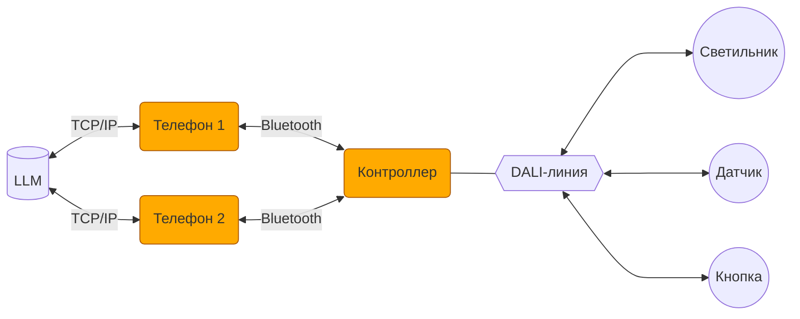

# АПК Синапс v1.0. ПО. ТЗ

**Версия документа:** 1.0  
**Дата создания:** 11.11.2025  
**Статус:** Черновик

## 1. Назначение

1.1. Пуско-наладка, настройка, оперативное управление и автоматическая работа осветительного оборудования с применением стандарта DALI.

## 2. Функции комплекса

2.1. Пуско-наладочные работы с оборудованием, подключаемым к линии DALI.

2.2. Настройка режимов работы оборудования под требования пользователя.

2.3. Оперативное управление оборудованием.

2.4. Автоматическая работа освещения по датчикам присутствия и освещенности.

2.5. Работа оборудования по расписанию.

## 3. Термины и определения

3.1. **АПК** — аппаратно-программный комплекс.

3.2. **Контроллер** — устройство на базе микроконтроллера GD32F103RBT6, работающее с устройствами DALI.

3.3. **Прошивка** — firmware в контроллере.

3.4. **Телефон** — мобильное устройство, обеспечивающее пользовательский интерфейс АПК.

3.5. **Приложение** — интерфейсное мобильное приложение в телефоне.

3.6. **LLM** — Large Language Model (большая языковая модель).

3.7. **Локация** — помещение или часть помещения с отдельно от других частей объекта организованной работой освещения. В АПК все локации одного уровня. Иерархия локаций не предусмотрена.

3.8. **Действие (ACTION)** — изменение состояния системы освещения. Действие может включать неограниченное количество изменений различных параметров: изменение состояния светильников, активация/деактивация датчиков... Действия навешиваются на нажатия кнопок, сработки датчиков, события в расписании.

3.9. **Оперативное управление** — ручная установка пользователем яркости, цвета и температуры света светильников.

3.10. **Настройка** — установка пользователем параметров устройств, активация/деактивация датчиков, задание расписания с целью приведения работы освещения под свои требования.

3.11. **ПНР** — первичное конфигурирование устройств после монтажа (инициализация линии DALI); установка параметров устройств, изменение которых конечными пользователями в процессе эксплуатации не предполагается (MIN LEVEL, MAX LEVEL...).

## 4. Аппаратная архитектура АПК

4.1. В АПК входят контроллер и один или несколько телефонов.

4.2. Телефоны подключаются к контроллеру по Bluetooth.

4.3. С контроллером одновременно могут работать (быть подключены) несколько телефонов.

4.4. К контроллеру подключается 1 линия DALI, устройствами в которой управляет АПК.

4.5. Телефон посредством интернет-соединения подключается к LLM, развернутой на сервере AWADA (или возможно в телефоне?).

## 5. Локации

5.1. Контроллер (если он проинициализирован) должен иметь не менее одной локации.

5.2. Каждое устройство привязывается к одной из локаций.

5.3. При инициализации создается одна локация, в которую помещаются все найденные в линии DALI устройства.

5.4. Создание других локаций и распределение устройств по ним происходит по командам от приложения.

5.5. Количество локаций не ограничено.

5.6. Все локации находятся на одном уровне, никакой многоуровневой иерархии не предусмотрено.

5.7. У локации есть флаг — работает ли локация в автоматическом режиме по датчикам присутствия и освещенности. Если АВТО - выкл, сигналы от датчиков, меняющие освещение в данной локации, игнорируются.

## 6. Светильники

6.1. Количество светильников ограничено емкостью линии DALI: 64 шт.

6.2. Поддерживаемые типы светильников: реле, диммер, RGB, RGBW, TW.

6.3. Светильник должен находиться в одной из локаций.

## 12. Световые сцены

12.1. Световые (цветовые, температурно-световые) сцены в АПК соответствуют DALI-сценам и используют DALI-механизм сцен.

12.2. 5 сквозных сцен (DALI-сцены 0..4) распространяются на все светильники.

12.3. По умолчанию в сценах 0..4 светильники имеют:
- яркость: 0, 25, 50, 75, 100%;
- цвет: красный с максимальной насыщенностью;
- температуру: 3000К.

12.4. Состояние светильников в сцены может сохраняться:
- отдельным светильником;
- группой светильников.

12.5. Команда на включение сцены может быть отдана пользователем:
- отдельному светильнику;
- группе светильников;
- всем светильникам локации;
- всем светильникам контроллера.

## 11. Группы светильников

11.1. Светильники в рамках локации могут быть объединены в группы.

11.2. Группы в АПК соответствуют DALI-группам и используют DALI-механизм групп.

11.3. Общее максимальное количество групп на все локации — 16.

11.4. Светильник может входить только в одну группу или быть вне групп (чтобы отдельные светильники не занимали DALI-группы, которых на всех не хватит).

11.5. Светильники, объединенные в группу, получают возможность группового управления.

11.6. У светильников в группе остается возможность индивидуального управления и настройки.

## 10. Кнопочные панели

10.1. Кнопочные панели — основной инструмент пользователя для оперативного управления освещением.

10.2. На **короткое нажатие** кнопки могут быть повешены одно или несколько действий:
- Если действие одно — при нажатии на кнопку оно и случается.
- Если действий несколько — они выполняются перебором.

10.3. На **долгое нажатие** можно повесить одно действие. При нажатии и удержании бинарные параметры меняются сразу, количественные плавно меняются в направлении целевых значений.

10.4. Действия можно вешать и на короткое, и на длинное нажатия одновременно.

## 7. Устройства управления

7.1. Количество устройств управления ограничено емкостью линии DALI: 64 шт.

7.2. Типы устройств управления: датчики присутствия и освещенности, кнопочные панели.

## 8. Датчики присутствия

8.1. На датчик навешиваются два действия (ACTIONS, см. ниже): присутствие/отсутствие.

8.2. Датчик может быть активирован/деактивирован (в том числе по действию (ACTION)).

8.3. Все датчики в отдельно взятой локации могут быть активированы/деактивированы тумблером AUTO в приложении.

8.4. Если пользователь в локации, в рамках оперативного управления, кнопкой на стене или в телефоне включает любую сцену или меняет яркость (у группы или отдельного светильника), сообщения от датчиков присутствия в этой локации о регистрации движения игнорируются до появления сигнала об отсутствии присутствия (тогда срабатывает действие, повешенное на отсутствие, и дальше всё идёт в АВТО (если АВТО явно не отключено у датчика)).

## 9. Датчики освещенности

9.1. Датчику назначается группа (и только одна) из той же локации, что и датчик, которой он управляет для поддержания искомой освещенности.

9.2. Датчик может быть активирован/деактивирован (в том числе по действию (ACTION)).

9.3. Все датчики в локации могут быть активированы/деактивированы тумблером AUTO в этой локации в приложении.

9.4. Датчик по команде из приложения запоминает текущую освещенность как целевую.

9.5. Если пользователь в локации, в рамках оперативного управления, кнопкой на стене или в телефоне включает любую сцену или меняет яркость (у группы или отдельного светильника), датчики освещенности в этой локации перестают поддерживать целевую освещенность до появления сигнала об отсутствии присутствия (тогда срабатывает действие, повешенное на отсутствие, и дальше всё идёт в АВТО (если АВТО явно не отключено у датчика)).

## 13. Действия

13.1. Действия (ACTIONS) — изменения параметров устройств.

13.2. Навешиваются на нажатия кнопок, срабатывание датчиков, события расписания.

13.3. Действие может распространяться на любой набор светильников, датчиков, сцен.

13.4. Действие универсально — несмотря на расположение инициирующего устройства может распространяться на любые локации и весь объект.

## 14. Расписание

14.1. Расписание задается в виде набора событий (EVENTS).

14.2. Расписание задается одно для всего контроллера.

14.3. Расписание может быть активировано/деактивировано.

14.4. Необходимость действий (ACTIONS) по событиям расписания (EVENTS) проверяется контроллером раз в 1 минуту.

14.5. Приоритет действий, навешенных на один момент времени, определяется порядком событий в списке событий расписания. Действия проверяются и выполняются контроллером в порядке сверху вниз.

14.6. Если пользователь назначает действие с устройством на момент времени, уже отмеченный в расписании, приложение выводит предупреждение об этом с комментарием про приоритет. Но задавать такие события разрешено.

14.7. Действие может производиться одномоментно (EVENTS.SMOOTH = F), когда параметры меняются шагово, и плавно (EVENTS.SMOOTH = T), когда параметры, меняемые у устройств, линейно изменяются от предыдущих значений к значениям, заданным в ACTIONS.

14.8. При плавном изменении параметров (SMOOTH = T) изменение производится раз в 1 минуту.

## 15. Прошивка

15.1. Возможность обновления прошивки с помощью приложения.

15.2. Программная кнопка на контроллере, сбрасывающая:
- **долгим нажатием** настройки прошивки (не исполняемый код) в заводское состояние;
- **коротким нажатием** только пароль в заводский.

15.3. Автоматическая работа по датчикам и расписанию при соответствующих флагах, выставленных в локациях.

15.4. Опрос текущего состояния устройств в периоды затишья.

15.5. При отправке устройствам команд на изменение состояния последующий опрос того, подействовали ли эти команды, не предполагается. Выстрелили сообразно стандартам DALI и забыли. Сказали светильнику включиться на 33, считаем, что он включился на 33.

## 16. Прошивка. ПНР

16.1. Инициализация линии DALI со сбросом настроек устройств к заводским по команде от приложения.

16.2. При инициализации кроме DALI-настроек удаляются все локации (и создается одна, в которую все вновь найденные устройства складируются), расписание.

16.3. Передача в приложение текущего статуса инициализации устройств для информирования пользователя о ходе процесса.

16.4. Добавление новых устройств в линию без пересбора линии.

16.5. Замена вышедших из строя устройств без пересбора линии:
- подключение новых устройств к линии;
- поиск устройств;
- сопоставление их вышедшим из строя (с разрешением неоднозначностей пользователем);
- перенос старых настроек в новые устройства (название, короткий адрес DALI, FADETIME и т. д.).

## 17. Приложение

17.1. Версии приложения — Android, iOS.

17.2. Светлая и темная темы интерфейса.

17.3. Приложение используется в первую очередь для ПНР и настройки. Задача оперативного управления лежит на настенных кнопках.

17.4. Структура локальной базы данных в приложении аналогична БД в контроллере.

17.5. В БД приложения хранятся данные всех актуальных контроллеров, к которым подключалось приложение.

17.6. При подключении к контроллеру приложение актуализирует соответствующие записи в своей БД.

17.7. Заход в контроллер возможен только при наличии bluetooth-соединения с контроллером.

17.8. При пропадании связи с контроллером и после нескольких безуспешных попыток ее восстановить приложение выкидывает пользователя в список контроллеров.

17.9. При появлении связи с контроллером, из которого вылетели по причине пропадания связи, заходим в него автоматом в прежнюю локацию (если не успели зайти в другой контроллер).

17.10. Перекодировки из человеческой шкалы 0..100 в нечеловеческую 0..255, равно как и из HSB в RGB, производятся в приложении в момент сохранения значений в базу. В базе значения RGB(W) разложены в R, G и B (W).

## 18. Приложение. База данных

18.1. Данные в прошивке/приложении делятся на два типа:
- **Рабочие** — необходимые для организации работы освещения в прошивке и приложении (помечены ниже жирным);
- **Интерфейсные** — используемые только приложением и хранящиеся в прошивке только ради передачи их между несколькими телефонами.

18.2. CONTROLLER — таблица с одной записью (в отличие от приложения):

- **NAME** — название контроллера, показываемое в приложении;
- **PASSWORD** — пинкод; 4 цифры; заводской на коробке (или наклейке на корпусе);
- **ICO_NUM** — номер иконки, которую будет иметь контроллер в приложении; 0 — дефолтная, заводская.

18.3. LOCATIONS — локации

- NUM — порядковый номер локации;
- NAME — название локации;
- ICO_NUM — номер иконки, которую будет иметь локация в приложении; 0 — дефолтная, заводская;
- **IS_AUTO** — T/F — работает ли локация в автоматическом режиме по датчикам;
- **IS_PRES_AUTO** — T/F — работает ли локация в автоматическом режиме по датчикам присутствия;
- **IS_BRIGHT_AUTO** — T/F — работает ли локация в автоматическом режиме по датчикам освещенности;
- **IS_SCHEDULE** — T/F — включена ли в локации работа по расписанию;
- SCALE — 1..3 — масштаб сетки с иконками светильников;
- POS — 0..255 — позиция локации в списке локаций.

18.4. GROUPS — группы светильников

- NAME — название группы;
- **DALI_NUM** — номер группы в DALI;
- **LOCATION_ID** — идентификатор локации.

18.5. LUMINAIRES — светильники

- NAME — название светильника;
- **DALI_ADDR** — короткий адрес DALI;
- **LOCATION_ID** — идентификатор локации;
- **GROUP_ID** — идентификатор группы; NULL, если не в группе;
- ICO_NUM — номер иконки, которую будет иметь светильник в приложении; 0 — дефолтная, заводская;
- POS_X — 0..255 — колонка иконки в сетке светильников;
- POS_Y — 0..255 — ряд иконки в сетке светильников.

18.6. PRES_SENSORS — датчики присутствия

- NAME — название датчика;
- **DALI_ADDR** — короткий адрес DALI;
- **DALI_INST** — номер инстанса в DALI;
- **LOCATION_ID** — идентификатор локации;
- **DELAY** — задержка выключения (секунды).

18.7. BRIGHT_SENSORS — датчики освещенности

- NAME — название датчика;
- **DALI_ADDR** — короткий адрес DALI;
- **DALI_INST** — номер инстанса в DALI;
- **LOCATION_ID** — идентификатор локации;
- **GROUP_ID** — идентификатор группы, которой управляет датчик;
- **BRIGHTNESS** — пороговое значение освещенности.

18.8. BUTTON_PANELS — кнопочные панели

- NAME — название панели;
- **DALI_ADDR** — короткий адрес DALI;
- **LOCATION_ID** — идентификатор локации.

18.9. BUTTONS — кнопки

- NUM — номер кнопки на панели;
- **BUTTON_PANEL_ID** — идентификатор панели;
- **DALI_INST** — номер инстанса в DALI;
- **ACTION_ID** — действие по нажатию;
- **LONG_PRESS** — T/F — обрабатывается ли долгое нажатие.

18.10. ACTIONS — действия с устройствами

- **GROUP_ID** — идентификатор группы; если действие на группу;
- **LUMINAIRE_ID** — идентификатор светильника; если действие на отдельный светильник;
- **SCENE_ID** — идентификатор сцены;
- **VAL_BRIGHT** — значение яркости;
- **VAL_TW** — значение температуры белого света;
- **VAL_R** — значение красного канала (для RGB);
- **VAL_G** — значение зеленого канала (для RGB);
- **VAL_B** — значение синего канала (для RGB);
- **VAL_W** — значение белого канала (для RGBW).

18.11. EVENTS — события расписания

- **DATE_EVERYDAY** — T/F — ежедневное событие;
- **DATE_DAYS** — 'FFTFFFF' — событие по дням недели;
- **DATE_SPECIFIC** — конкретная дата;
- **TIME** — время события с точностью до минуты;
- **SMOOTH** — T/F — плавное изменение параметра от предыдущего значения (яркость, температура света);
- **ACTION_ID** — идентификатор действия.

## 19. Приложение. Основные страницы

19.1. **Настройки приложения** — переключение тем интерфейса, невключенные разрешения Андроида (с переходом на их включение).

19.2. **Список контроллеров** — старые и вновь найденные контроллеры, выбор контроллера для подключения.

19.3. **Контроллер** — список локаций контроллера, оперативное управление всеми светильниками, расписание.

19.4. **Настройки контроллера** — название, иконка, пароль, инициализация/расширение линии, обновление прошивки контроллера, удаление контроллера.

19.5. **Локация** — оперативное управление светильниками локации, переход на страницы светильников, датчиков и кнопок локации, расписание, АВТО/НЕАВТО.

19.6. **Настройки локации** — название, иконка, перемещение иконок светильников, формирование групп светильников, перемещение устройств между локациями.

19.7. **Светильник** — расширенное оперативное управление.

19.8. **Настройки светильника** — группа, название, иконка, DALI-параметры, удаление светильника.

19.9. **Настройки датчика присутствия** — активация/деактивация, задержка, назначение действий при срабатывании, название, DALI-параметры, удаление датчика.

19.10. **Настройки датчика освещенности** — активация/деактивация, целевая освещенность, управляемая группа светильников, название, DALI-параметры, удаление датчика.

19.11. **Настройки кнопочной панели** — назначение действий на кнопки, название, удаление панели.

19.12. **Расписание** — редактирование расписания.

## 20. Приложение. Подключение к контроллеру

20.1. При заходе в приложение — список контроллеров:
- Контроллеры, к которым уже было подключение на этом телефоне, независимо от того, на связи они в данный момент или нет (нужен признак — на связи или нет). Иконка и название не дефолтные (если менялись).
- Найденные новые по признаку названия "SYNAPSE XXXXXXXX" bluetooth-устройства (где XXXXXXXX — серийный номер контроллера). С таким дефолтным названием и дефолтной иконкой. (Проверить возможность вывода новых устройств тоже с измененными названиями и иконками, если кто-то уже их настраивал. В названии bluetooth-устройства, как оно видно в списке таких устройств в телефоне, оставлять начало "SYNAPSE" всегда, дальше добавлять номер иконки, дальше наименование. Парсить это и выводить в нашем приложении как у подключавшихся контроллеров.)

20.2. При подключении к новому контроллеру запрашивается пароль.

20.3. Заводской пароль указывается на упаковке контроллера или на его корпусе.

20.4. Зашедший в контроллер пользователь может поменять пароль.

20.5. Сброс к заводским настройкам сбрасывает пароль на заводской.

20.6. При следующих подключениях к контроллеру пароль не запрашивается.

20.7. Контроллер можно удалить из списка. При следующем поиске он появится среди вновь найденных.

20.8. Контроллеру можно назначить другое имя и пиктограмму. Имя и пиктограмма (номер) хранятся в контроллере.

20.9. Если при предыдущем закрытии приложения пользователь находился в контроллере в какой-то локации и при запуске приложения этот контроллер доступен, приложение автоматически заходит в этот контроллер и в эту локацию.

## 21. Приложение. ПНР

21.1. Находясь в контроллере, пользователь может запустить процесс инициализации линии DALI.

21.2. После отправки команды инициализации на контроллер показывается прогресс инициализации, любые действия с контроллером до ее окончания невозможны, пользователь может выйти из контроллера или закрыть приложение (инициализацию проводит контроллер автономно).

21.3. Возможно расширение линии за счет вновь подключенных устройств. Устройства добавляются с дефолтными параметрами в новую локацию.

21.4. Если устройство вышло из строя (что должно быть показано на иконке устройства), пользователь может, зайдя в настройки устройства, осуществить привязку нового экземпляра на старое место (если он по типу совпадает).

21.5. Установка ПНР-параметров DALI-устройств на соответствующих страницах настроек.

## 22. Приложение. Настройка

22.1. Групповая настройка светильников.

*Раздел в разработке.*

## 23. Приложение. Оперативное управление

23.1. Групповое управление светильниками.

*Раздел в разработке.*

## 24. Приложение. LLM

*Раздел в разработке.*
