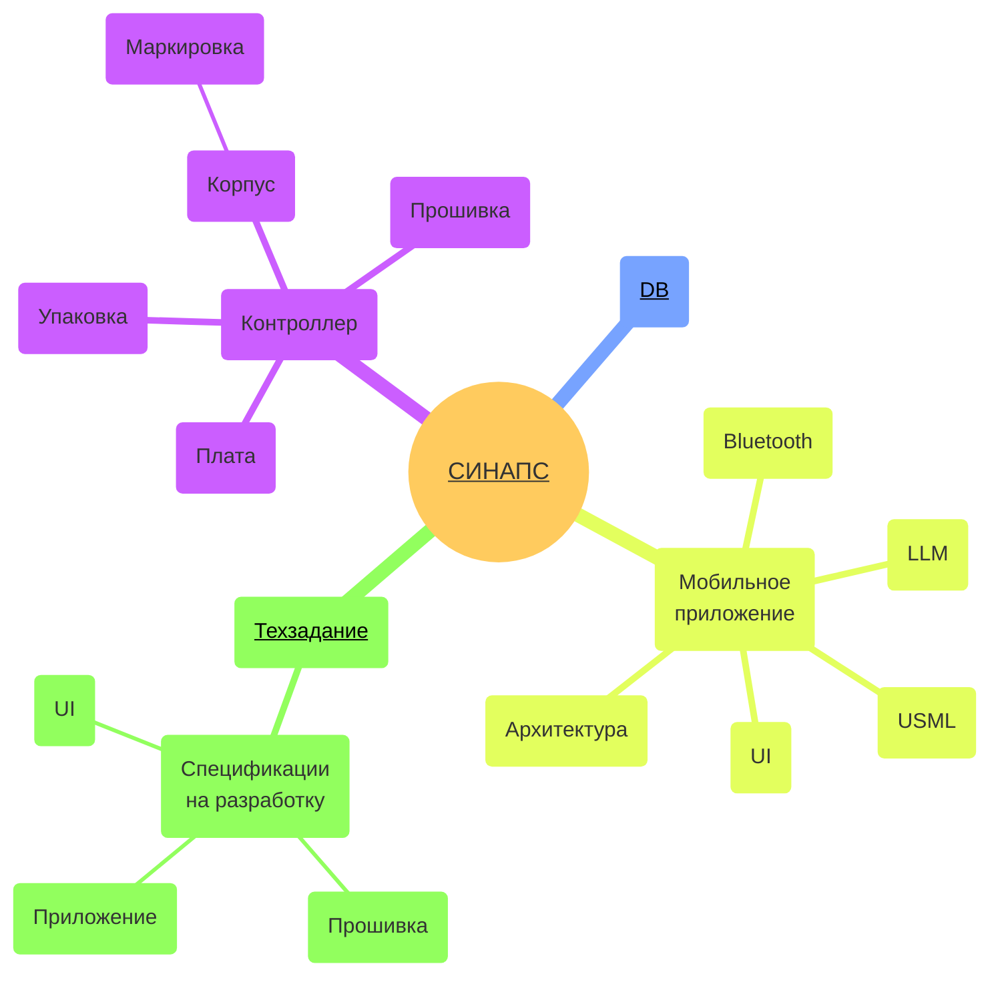

# Мозгокарта

```mermaid
---
config:
  theme: 'base'
---

mindmap
  root((<a href="index.html" style="color:inherit; font-size: large; padding:20px; background-color:#006a8e; text-decoration:underline">СИНАПС))
    (Контроллер)
      (Прошивка)
      (Плата)
      (Корпус)
        (Маркировка)
      (Упаковка)
    (<a href="PDS/db_schema_mermaid.html" style="color:black; text-decoration:underline">DB)
    (Мобильное<br>приложение)
      (UI)
      (Bluetooth)
      (USML)
      (LLM)
      (Архитектура)
    (<a href="PRD/SynapsePRD.html" style="color:black; text-decoration:underline">Техзадание)
      (Спецификации<br>на разработку)
        (Прошивка)
        (Приложение)
        (UI)
```

