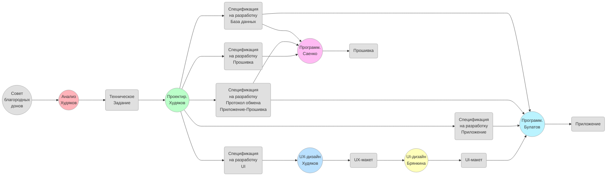

# Процесс разработки

```mermaid
flowchart LR
    SBD((Совет<br>благородных<br>донов))
    
    ANAL((Анализ<br>Худяков))
    
    PRD(Техническое<br>Задание)
    
    PRO((Проектир.<br>Худяков))
    
    DSUI(Спецификация<br>на разработку<br>UI)
    DSAPP(Спецификация<br>на разработку<br>Приложение)
    DSDB(Спецификация<br>на разработку<br>База данных)
    DSP(Спецификация<br>на разработку<br>Протокол обмена<br>Приложение-Прошивка)
    DSFW(Спецификация<br>на разработку<br>Прошивка)

    UIUXD((UX-дизайн<br>Худяков))
    UIUX( UX-макет )
    APPD(( Программ.<br>Булатов ))

    FWD(( Программ.<br>Саенко ))

    UIUID((UI-дизайн<br>Брянкина))
    UIUI( UI-макет )

    FW( Прошивка )
    APP( Приложение )

    SBD ---> ANAL
    ANAL ---> PRD
    PRD ---> PRO
    PRO ---> DSUI
    PRO ---> DSFW
    PRO ---> DSAPP
    PRO ---> DSP
    PRO ---> DSDB

    DSUI ---> UIUXD
    UIUXD ---> UIUX
    UIUX ---> UIUID
    UIUID ---> UIUI

    UIUI ---> APPD
    DSAPP ---> APPD
    DSP ---> APPD
    DSDB ---> APPD

    DSFW ---> FWD
    DSP ---> FWD
    DSDB ---> FWD

    FWD ---> FW
    APPD ---> APP

    style ANAL fill:#FFB3BA,stroke:#999
    style PRO fill:#BAFFC9,stroke:#999
    style UIUXD fill:#BAE1FF,stroke:#999
    style UIUID fill:#FFFFBA,stroke:#999
    style APPD fill:#BAF3FF,stroke:#999
    style FWD fill:#FFBAF3,stroke:#999
    
    style SBD fill:#E0E0E0,stroke:#999
    style PRD fill:#E0E0E0,stroke:#999
    style DSUI fill:#E0E0E0,stroke:#999
    style DSAPP fill:#E0E0E0,stroke:#999
    style DSDB fill:#E0E0E0,stroke:#999
    style DSP fill:#E0E0E0,stroke:#999
    style DSFW fill:#E0E0E0,stroke:#999
    style UIUX fill:#E0E0E0,stroke:#999
    style UIUI fill:#E0E0E0,stroke:#999
    style FW fill:#E0E0E0,stroke:#999
    style APP fill:#E0E0E0,stroke:#999

    click PRD "https://khudyakovalex.github.io/Synapse/INDEX/PRD/SynapsePRD.html"
```