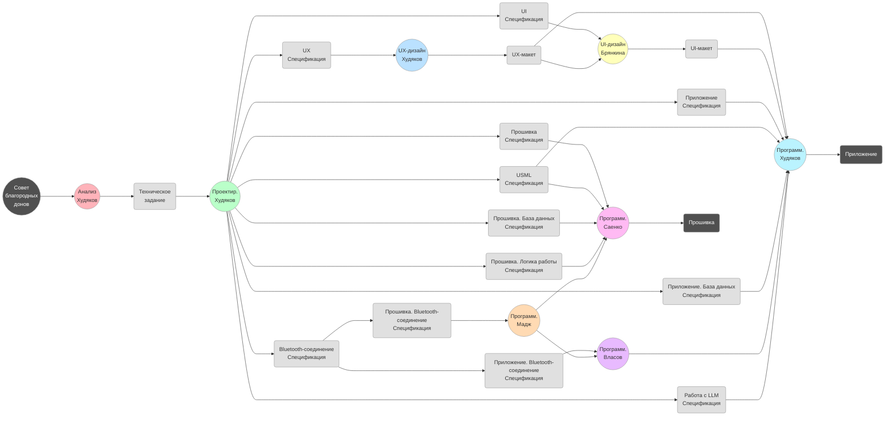

# Процесс разработки

```mermaid
flowchart LR
    SBD((Совет<br>благородных<br>донов))
    
    SBD ---> ANAL

    ANAL((Анализ<br>Худяков))
    
    ANAL ---> PRD

    PRD(Техническое<br>задание)
    
    PRD ---> PRO

    PRO((Проектир.<br>Худяков))

    PRO ---> DSUI
    PRO ---> DSUX
    PRO ---> DSFW
    PRO ---> DSAPP
    PRO ---> DSP
    PRO ---> DSDB
    PRO ---> DSFWDB
    PRO ---> DSFWL
    PRO ---> DSB
    PRO ---> DSLLM

    DSUX(UX<br>Спецификация)
    DSUI(UI<br>Спецификация)
    DSAPP(Приложение<br>Спецификация)
    DSDB(Приложение. База данных<br>Спецификация)
    DSFWDB(Прошивка. База данных<br>Спецификация)
    DSFWL(Прошивка. Логика работы<br>Спецификация)
    DSP(USML<br>Спецификация)
    DSB(Bluetooth-соединение<br>Спецификация)
    DSLLM(Работа с LLM<br>Спецификация)
    DSFW(Прошивка<br>Спецификация)

    DSUX ---> UIUXD
    DSUI ---> UIUID
    DSB ---> DSFWB
    DSB ---> DSAPPB

    UIUXD((UX-дизайн<br>Худяков))
    DSFWB(Прошивка. Bluetooth-соединение<br>Спецификация)
    DSAPPB(Приложение. Bluetooth-соединение<br>Спецификация)

    UIUXD ---> UIUX
    DSAPPB ---> APPB
    DSFWB ---> FWB

    UIUX( UX-макет )
    APPB(( Программ.<br>Власов ))
    FWB(( Программ.<br>Мадж ))

    FWB ---> APPB
    UIUX ---> UIUID

    UIUID((UI-дизайн<br>Брянкина))

    UIUID ---> UIUI

    UIUI( UI-макет )

    UIUX ---> APPD
    UIUI ---> APPD

    DSAPP ---> APPD
    DSP ---> APPD
    DSDB ---> APPD
    APPB ---> APPD
    DSLLM ---> APPD

    DSFW ---> FWD
    DSP ---> FWD
    DSFWDB ---> FWD
    DSFWL ---> FWD
    FWB ---> FWD

    APPD(( Программ.<br>Худяков ))
    FWD(( Программ.<br>Саенко ))

    FWD ---> FW
    APPD ---> APP

    FW( Прошивка )
    APP( Приложение )

    style SBD fill:#505050,stroke:#999,color:#fff
    style ANAL fill:#FFB3BA,stroke:#999
    style PRO fill:#BAFFC9,stroke:#999
    style UIUXD fill:#BAE1FF,stroke:#999
    style UIUID fill:#FFFFBA,stroke:#999
    style APPB fill:#E8BAFF,stroke:#999
    style FWB fill:#FFDAB3,stroke:#999
    style APPD fill:#BAF3FF,stroke:#999
    style FWD fill:#FFBAF3,stroke:#999
    style PRD fill:#E0E0E0,stroke:#999
    style DSUI fill:#E0E0E0,stroke:#999
    style DSAPP fill:#E0E0E0,stroke:#999
    style DSDB fill:#E0E0E0,stroke:#999
    style DSP fill:#E0E0E0,stroke:#999
    style DSFW fill:#E0E0E0,stroke:#999
    style DSUX fill:#E0E0E0,stroke:#999
    style DSB fill:#E0E0E0,stroke:#999
    style DSLLM fill:#E0E0E0,stroke:#999
    style UIUX fill:#E0E0E0,stroke:#999
    style UIUI fill:#E0E0E0,stroke:#999
    style DSFWB fill:#E0E0E0,stroke:#999
    style DSAPPB fill:#E0E0E0,stroke:#999
    style DSFWDB fill:#E0E0E0,stroke:#999
    style DSFWL fill:#E0E0E0,stroke:#999
    style FW fill:#505050,stroke:#999,color:#fff
    style APP fill:#505050,stroke:#999,color:#fff

    click PRD "PRD/SynapsePRD.html"
    click DSUI "PDS/SynapsePDS_APP_UI.html"
    click DSUX "PDS/SynapsePDS_APP_UX.html"
    click DSAPP "PDS/SynapsePDS_APP.html"
    click DSDB "PDS/SynapsePDS_APP_DB.html"
    click DSP "PDS/SynapsePDS_USML.html"
    click DSB "PDS/SynapsePDS_Bluetooth.html"
    click DSLLM "PDS/SynapsePDS_LLM.html"
    click DSFW "PDS/SynapsePDS_FW.html"
    click DSFWB "PDS/SynapsePDS_FW_Bluetooth.html"
    click DSAPPB "PDS/SynapsePDS_APP_Bluetooth.html"
    click DSFWDB "PDS/SynapsePDS_FW_DB.html"
    click DSFWL "PDS/SynapsePDS_FW_Logic.html"

```