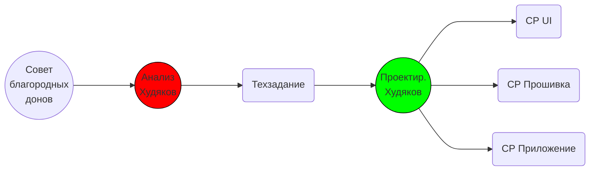

# Процесс разработки

```mermaid
flowchart LR
    SBD((Совет<br>благородных<br>донов))
    ANAL((Анализ<br>Худяков))
    PRD( Техзадание )
    PRO((Проектир.<br>Худяков))
    DSUI( СР UI )
    DSFW( СР Прошивка )
    DSAPP( СР Приложение )

    SBD ---> ANAL
    ANAL ---> PRD
    PRD ---> PRO
    PRO ---> DSUI
    PRO ---> DSFW
    PRO ---> DSAPP

    style ANAL fill:#F00,stroke:#000
    style PRO fill:#0F0,stroke:#000

    click PRD "https://khudyakovalex.github.io/Synapse/INDEX/PRD/SynapsePRD.html"
```