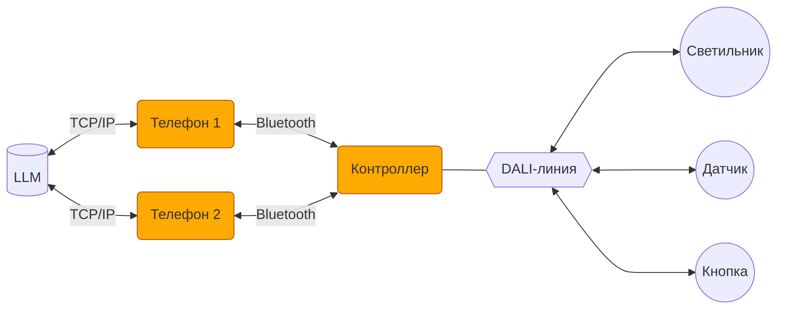

# АПК Синапс v1.0. ПО. ТЗ

**Версия документа:** 1.0  
**Дата создания:** 11.11.2025  
**Статус:** Черновик

## 1. Назначение

1.1. Пуско-наладка, настройка, оперативное управление и автоматическая работа осветительного оборудования с применением стандарта DALI.

## 2. Функции комплекса

2.1. Пуско-наладочные работы с оборудованием, подключаемым к линии DALI.

2.2. Настройка режимов работы оборудования под требования пользователя.

2.3. Оперативное управление оборудованием.

2.4. Автоматическая работа освещения по датчикам присутствия и освещенности.

2.5. Работа оборудования по расписанию.

## 3. Термины и определения

3.1. **АПК** — аппаратно-программный комплекс.

3.2. **Контроллер** — устройство на базе микроконтроллера GD32F103RBT6, работающее с устройствами DALI.

3.3. **Прошивка** — firmware в контроллере.

3.4. **Телефон** — мобильное устройство, обеспечивающее пользовательский интерфейс АПК.

3.5. **Приложение** — интерфейсное мобильное приложение в телефоне.

3.6. **LLM** — Large Language Model (большая языковая модель).

3.7. **Локация** — помещение или часть помещения с отдельно от других частей объекта организованной работой освещения.

3.8. **Оперативное управление** — ручная установка пользователем яркости, цвета и температуры света светильников.

3.9. **Настройка** — установка пользователем параметров устройств, активация/деактивация датчиков, задание расписания с целью приведения работы освещения под свои требования.

3.10. **ПНР** — первичное конфигурирование устройств после монтажа (инициализация линии DALI); установка параметров устройств, изменение которых конечными пользователями в процессе эксплуатации не предполагается (MIN LEVEL, MAX LEVEL...).

## 4. Аппаратная архитектура АПК

4.1. В АПК входят контроллер и один, два или несколько телефонов.

4.2. Телефоны подключаются к контроллеру по Bluetooth.

4.3. С контроллером одновременно могут работать (быть подключены) несколько телефонов.

4.4. К контроллеру подключается 1 линия DALI, устройствами в которой управляет АПК.

4.5. Телефон посредством интернет-соединения подключается к LLM, развернутой на сервере AWADA (или возможно в телефоне?).

## 5. Светильники

5.1. Количество светильников ограничено емкостью линии DALI: 64 шт.

5.2. Поддерживаемые типы светильников: реле, диммер, RGB, RGBW, TW.

## 6. Устройства управления

6.1. Количество устройств управления ограничено емкостью линии DALI: 64 шт.

6.2. Типы устройств управления: датчики присутствия и освещенности, кнопочные панели.

## 7. Датчики присутствия

7.1. На датчик навешиваются два действия (ACTIONS): присутствие / отсутствие.

7.2. Датчик может быть активирован / деактивирован (в том числе по действию (ACTION)).

## 8. Датчики освещенности

8.1. Датчику назначается группа из той же локации, что и датчик, которой он управляет для поддержания искомой освещенности.

8.2. Датчик может быть активирован / деактивирован (в том числе по действию (ACTION)).

## 9. Кнопочные панели

9.1. Кнопочные панели используются для оперативного управления освещением без использования мобильного приложения.

9.2. На короткие нажатия кнопок навешиваются действия (ACTIONS).

9.3. На долгие нажатия кнопок навешиваются действия (ACTIONS). При удержании кнопки нажатой устройства, указанные в действии, плавно меняют параметры, указанные в действии, в направлении значений параметров, также указанных в действии.

## 10. Локации

10.1. Устройства распределяются по локациям.

10.2. Устройство должно входить в локацию и только в одну.

10.3. Количество локаций не ограничено.

## 11. Группы

11.1. Светильники в рамках локации могут быть объединены в группы.

11.2. Группы в АПК соответствуют DALI-группам и используют DALI-механизм групп.

11.3. Общее максимальное количество групп на все локации — 16.

11.4. Светильник может входить только в одну группу или быть вне групп.

11.5. Светильники, объединенные в группу, получают возможность группового управления.

## 12. Световые сцены

12.1. Сцены в АПК соответствуют DALI-сценам и используют DALI-механизм сцен.

12.2. 5 сцен (DALI-сцены 0..4) распространяются на все светильники в АПК.

12.3. По умолчанию сцены 0..4 — яркости всех светильников: 0, 25, 50, 75, 100 %.

12.4. 5 сцен (DALI-сцены 5..9) распространяются на все светильники в группах.

12.5. По умолчанию сцены 5..9 — яркости всех светильников в группах: 0, 25, 50, 75, 100 %.

12.6. С помощью приложения сценам 0..4 могут быть назначены произвольные яркости всех светильников АПК.

12.7. С помощью приложения сценам 5..9 для каждой из групп могут быть назначены произвольные яркости светильников, входящих в эти группы.

## 13. Действия

13.1. Действия (ACTIONS) — изменения параметров устройств.

13.2. Навешиваются на нажатия кнопок, срабатывание датчиков, события расписания.

13.3. Могут распространяться на глобальные и локальные группы, отдельные светильники, датчики.

13.4. Действие универсально — может распространяться на любые устройства в любых локациях.

## 14. Расписание

14.1. Расписание задается в виде набора событий (EVENTS).

14.2. Расписание задается одно для всего контроллера.

14.3. Расписание может быть активировано / деактивировано.

14.4. Необходимость действий (ACTIONS) по событиям расписания (EVENTS) проверяется контроллером раз в 1 минуту.

14.5. Приоритет действий, навешенных на один момент времени, определяется порядком событий в списке событий расписания. Действия проверяются и выполняются контроллером в порядке сверху вниз.

14.6. Если пользователь назначает действие с устройством на момент времени, уже отмеченный в расписании, приложение выводит предупреждение об этом с комментарием про приоритет. Но задавать такие события разрешено.

14.7. Действие может производиться одномоментно (EVENTS.SMOOTH = F), когда параметры меняются шагово, и плавно (EVENTS.SMOOTH = T), когда параметры, меняемые у устройств, линейно изменяются от предыдущих значений к значениям, заданным в ACTIONS.

14.8. При плавном изменении параметров (SMOOTH = T) изменение производится раз в 1 минуту.

## 15. Прошивка

15.1. Возможность обновления прошивки с помощью приложения.

15.2. Программная кнопка на контроллере, сбрасывающая:
- **долгим нажатием** настройки прошивки (не исполняемый код) в заводское состояние
- **коротким нажатием** только пароль в заводский

15.3. Автоматическая работа по датчикам и расписанию при соответствующих флагах, выставленных в локациях.

15.4. Опрос текущего состояния устройств в периоды затишья.

15.5. При отправке устройствам команд на изменение состояния последующий опрос того, подействовали ли эти команды, не предполагается. Выстрелили сообразно стандартам DALI и забыли. Сказали светильнику включиться на 33, считаем, что он включился на 33.

## 16. Прошивка. ПНР

16.1. Инициализация линии DALI со сбросом настроек устройств к заводским по команде от приложения.

16.2. При инициализации кроме DALI-настроек удаляются все локации (и создается одна, в которую все вновь найденные устройства складируются), расписание.

16.3. Передача в приложение текущего статуса инициализации устройств для информирования пользователя о ходе процесса.

16.4. Добавление новых устройств в линию без пересбора линии.

16.5. Замена вышедших из строя устройств без пересбора линии:

- подключение новых устройств к линии;
- поиск устройств;
- сопоставление их вышедшим из строя (с разрешением неоднозначностей пользователем);
- перенос старых настроек в новые устройства (название, короткий адрес DALI, FADETIME и т. д.).

## 17. Приложение

17.1. Версии приложения — Android, iOS.

17.2. Светлая и темная темы интерфейса.

17.3. Приложение используется в первую очередь для ПНР и настройки. Задача оперативного управления лежит на настенных кнопках.

17.4. Структура локальной базы данных в приложении аналогична БД в контроллере.

17.5. В БД приложения хранятся данные всех актуальных контроллеров, к которым подключалось приложение.

17.6. При подключении к контроллеру приложение актуализирует соответствующие записи в своей БД.

17.7. Заход в контроллер возможен только при наличии bluetooth-соединения с контроллером.

17.8. При пропадании связи с контроллером и после нескольких безуспешных попыток ее восстановить приложение выкидывает пользователя в список контроллеров.

17.9. При появлении связи с контроллером, из которого вылетели по причине пропадания связи, заходим в него автоматом в прежнюю локацию (если не успели зайти в другой контроллер).

17.10. Перекодировки из человеческой шкалы 0..100 в нечеловеческую 0..255, равно как и из HSB в RGB, производятся в приложении в момент сохранения значений в базу. В базе значения RGB(W) разложены в R, G и B (W).

## 18. Приложение. База данных

18.1. Данные в прошивке/приложении делятся на два типа:
- Рабочие — необходимые для организации работы освещения в прошивке и приложении (помечены ниже жирным);
- Интерфейсные — используемые только приложением и хранящиеся в прошивке только ради передачи их между несколькими телефонами.

18.2. CONTROLLER — таблица с одной записью (в отличие от приложения):

- **NAME** — название контроллера, показываемое в приложении;
- **PASSWORD** — пинкод; 4 цифры; заводской на коробке (или наклейке на корпусе);
- **ICO_NUM** — номер иконки, которую будет иметь контроллер в приложении; 0 — дефолтная, заводская.

18.3. LOCATIONS — локации

- NUM — порядковый номер локации;
- NAME — название локации;
- ICO_NUM — номер иконки, которую будет иметь локация в приложении; 0 — дефолтная, заводская;
- **IS_AUTO** — T/F — работает ли локация в автоматическом режиме по датчикам;
- **IS_PRES_AUTO** — T/F — работает ли локация в автоматическом режиме по датчикам присутствия;
- **IS_BRIGHT_AUTO** — T/F — работает ли локация в автоматическом режиме по датчикам освещенности;
- **IS_SCHEDULE** — T/F — включена ли в локации работа по расписанию;
- SCALE — 1..3 — масштаб сетки с иконками светильников;
- POS — 0..255 — позиция локации в списке локаций.

18.4. GROUPS — группы светильников

- NAME — название группы;
- **DALI_NUM** — номер группы в DALI;
- **LOCATION_ID** — идентификатор локации.

18.5. LUMINAIRES — светильники

- NAME — название светильника;
- **DALI_ADDR** — короткий адрес DALI;
- **LOCATION_ID** — идентификатор локации;
- **GROUP_ID** — идентификатор группы; NULL, если не в группе;
- ICO_NUM — номер иконки, которую будет иметь светильник в приложении; 0 — дефолтная, заводская;
- POS_X — 0..255 — колонка иконки в сетке светильников;
- POS_Y — 0..255 — ряд иконки в сетке светильников.

18.6. PRES_SENSORS — датчики присутствия

- NAME — название датчика;
- **DALI_ADDR** — короткий адрес DALI;
- **DALI_INST** — номер инстанса в DALI;
- **LOCATION_ID** — идентификатор локации;
- **DELAY** — задержка выключения (секунды).

18.7. BRIGHT_SENSORS — датчики освещенности

- NAME — название датчика;
- **DALI_ADDR** — короткий адрес DALI;
- **DALI_INST** — номер инстанса в DALI;
- **LOCATION_ID** — идентификатор локации;
- **GROUP_ID** — идентификатор группы, которой управляет датчик;
- **BRIGHTNESS** — пороговое значение освещенности.

18.8. BUTTON_PANELS — кнопочные панели

- NAME — название панели;
- **DALI_ADDR** — короткий адрес DALI;
- **LOCATION_ID** — идентификатор локации.

18.9. BUTTONS — кнопки

- NUM — номер кнопки на панели;
- **BUTTON_PANEL_ID** — идентификатор панели;
- **DALI_INST** — номер инстанса в DALI;
- **ACTION_ID** — действие по нажатию;
- **LONG_PRESS** — T/F — обрабатывается ли долгое нажатие.

18.10. ACTIONS — действия с устройствами

- **GROUP_ID** — идентификатор группы; если действие на группу;
- **LUMINAIRE_ID** — идентификатор светильника; если действие на отдельный светильник;
- **SCENE_ID** — идентификатор сцены;
- **VAL_BRIGHT** — значение яркости;
- **VAL_TW** — значение температуры белого света;
- **VAL_R** — значение красного канала (для RGB);
- **VAL_G** — значение зеленого канала (для RGB);
- **VAL_B** — значение синего канала (для RGB);
- **VAL_W** — значение белого канала (для RGBW).

18.11. EVENTS — события расписания

- **DATE_EVERYDAY** — T/F — ежедневное событие;
- **DATE_DAYS** — 'FFTFFFF' — событие по дням недели;
- **DATE_SPECIFIC** — конкретная дата;
- **TIME** — время события с точностью до минуты;
- **SMOOTH** — T/F — плавное изменение параметра от предыдущего значения (яркость, температура света);
- **ACTION_ID** — идентификатор действия.

## 19. Приложение. Основные страницы

19.1. **Настройки приложения** — переключение тем интерфейса.

19.2. **Список контроллеров** — старые и вновь найденные контроллеры, выбор контроллера для подключения.

19.3. **Контроллер** — список локаций контроллера, оперативное управление всеми светильниками, расписание.

19.4. **Настройки контроллера** — название, иконка, пароль, инициализация/расширение линии, обновление прошивки контроллера, удаление контроллера.

19.5. **Локация** — оперативное управление светильниками локации, переход на страницы светильников, датчиков и кнопок локации, расписание, АВТО/НЕАВТО.

19.6. **Настройки локации** — название, иконка, перемещение иконок светильников, формирование групп светильников, перемещение устройств между локациями.

19.7. **Светильник** — расширенное оперативное управление.

19.8. **Настройки светильника** — группа, название, иконка, DALI-параметры, удаление светильника.

19.9. **Настройки датчика присутствия** — активация / деактивация, задержка, назначение действий при срабатывании, название, DALI-параметры, удаление датчика.

19.10. **Настройки датчика освещенности** — активация / деактивация, целевая освещенность, управляемая группа светильников, название, DALI-параметры, удаление датчика.

19.11. **Настройки кнопочной панели** — назначение действий на кнопки, название, удаление панели.

19.12. **Расписание** — редактирование расписания.

## 20. Приложение. Подключение к контроллеру

20.1. При заходе в приложение — список контроллеров:

- Контроллеры, к которым уже было подключение на этом телефоне, независимо от того, на связи они в данный момент или нет. (Нужен признак — на связи или нет.) Иконка и название не дефолтные (если менялись).
- Найденные новые по признаку названия "SYNAPSE XXXXXXXX" bluetooth-устройства (где XXXXXXXX — серийный номер контроллера). С таким дефолтным названием и дефолтной иконкой. (Проверить возможность вывода новых устройств тоже с измененными названиями и иконками, если кто-то уже их настраивал. В названии bluetooth-устройства, как оно видно в списке таких устройств в телефоне, оставлять начало "SYNAPSE" всегда, дальше добавлять номер иконки, дальше наименование. Парсить это и выводить в нашем приложении как у подключавшихся контроллеров.)

20.2. При подключении к новому контроллеру запрашивается пароль.

20.3. Заводской пароль указывается на упаковке контроллера или на его корпусе.

20.4. Зашедший в контроллер пользователь может поменять пароль.

20.5. Сброс к заводским настройкам сбрасывает пароль на заводской.

20.6. При следующих подключениях к контроллеру пароль не запрашивается.

20.7. Контроллер можно удалить из списка. При следующем поиске он появится среди вновь найденных.

20.8. Контроллеру можно назначить другое имя и пиктограмму. Имя и пиктограмма (номер) хранятся в контроллере.

20.9. Если при предыдущем закрытии приложения пользователь находился в контроллере в какой-то локации и при запуске приложения этот контроллер доступен, приложение автоматически заходит в этот контроллер и в эту локацию.

## 21. Приложение. ПНР

21.1. Находясь в контроллере, пользователь может запустить процесс инициализации линии DALI.

21.2. После отправки команды инициализации на контроллер показывается прогресс инициализации, любые действия с контроллером до ее окончания невозможны, пользователь может выйти из контроллера или закрыть приложение (инициализацию проводит контроллер автономно).

21.3. Возможно расширение линии за счет вновь подключенных устройств. Устройства добавляются с дефолтными параметрами в новую локацию.

21.4. Если устройство вышло из строя (что должно быть показано на иконке устройства), пользователь может, зайдя в настройки устройства, осуществить привязку нового экземпляра на старое место (если он по типу совпадает).

21.5. Установка ПНР-параметров DALI-устройств на соответствующих страницах настроек.

## 22. Приложение. Настройка

ГРУППОВАЯ НАСТРОЙКА СВЕТИЛЬНИКОВ!!!

22.1.

## 23. Приложение. Оперативное управление

ГРУППОВОЕ УПРАВЛЕНИЕ СВЕТИЛЬНИКАМИ!!!

## 24. Приложение. LLM
