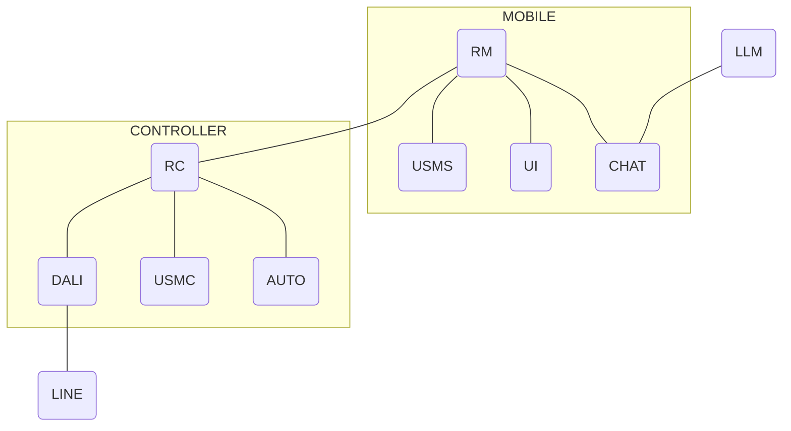

# Диаграмма системы

[📖 Описание компонентов](Components.md)

---

```mermaid
flowchart TB
    LLM(LLM)
    subgraph MOBILE
        direction TB
        UI(UI)
        CHAT(CHAT)
        RM(RM)
        USMS(USMS)
    end
    subgraph CONTROLLER
        direction TB
        AUTO(AUTO)
        DALI(DALI)
        RC(RC)
        USMC(USMC)
    end
    LINE(LINE)

    LLM --- CHAT

    RM --- CHAT
    RM --- UI
    RM --- USMS

    RM --- RC

    RC --- AUTO
    RC --- USMC
    RC --- DALI

    DALI --- LINE

```
